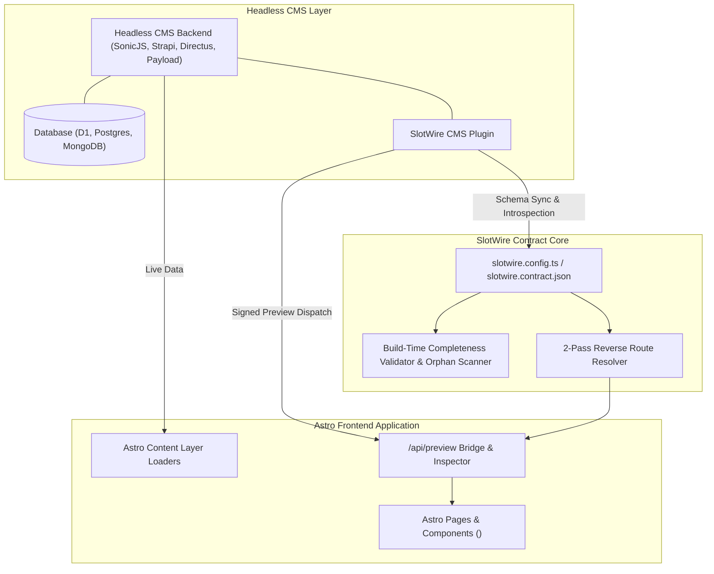

# SlotWire Architecture Specification

## 1. System Overview

SlotWire is a declarative 2-way contract engine and live preview bridge connecting modern frontend frameworks (Astro) with Headless CMS backends. It eliminates the "headless disconnect"—schema drift, blind CMS content modeling, and broken in-context preview workflows.



---

## 2. Core Subsystems

### A. Fluent Schema Contract Builder (`@slotwire/core`)
Frontend components declare their data requirements using fluent, Zod-backed contract builders:
* `s.object({...})`: Singletons, global settings, hero sections.
* `s.collection(name, {...})`: Repeatable collections, blogs, projects, services.
* `s.navigation({...})`: Formal site navigation menus (Header, Dropdowns, Footer).
* `s.page({ template, slots })`: Design-First page layout archetypes (`bento`, `narrative`, `standard`).
* `.previewRoute(pattern)`: Maps CMS collections to frontend URL routes using template strings (`/blog/{slug}`, `/#feature-bento`, `/{slug}`).

### B. Design-First Blueprint Resolution Engine
Calculates the full hierarchical dependency tree required to instantiate a new page:
1. **Cascade Scaffolding (`strategy: 'cascade'`)**: Recursively generates draft records for master pages, page sections, and nested feature card grids tied to the target `pageSlug`.
2. **Shared Reference Binding (`strategy: 'reference'`)**: Binds to global collections (e.g. shared testimonials, global footer CTAs) without database duplication.
3. **Navigation Integration (`addToMenu`)**: Atomically injects navigation records into `site_navigation` to link new pages into header or footer menus.

### C. 2-Pass Reverse Route Resolver
Translates incoming CMS requests (`collection`, `slug`, `id`) into precise frontend routes:
1. **Pass 1 (Exact Match)**: Matches exact collection keys (e.g. `blog_post` $\rightarrow$ `/blog/{slug}`, `blog_posts` $\rightarrow$ `/blog`).
2. **Pass 2 (Fuzzy Normalization)**: Normalizes casing, separators (`-`, `_`), and plural suffixes (`s`) to gracefully resolve aliases.
3. **Template Interpolation**: Replaces `{slug}` and `{id}` tokens with document values.

### D. Live In-Context Preview Bridge & Pre-Create Cloner (`astro-slotwire`)
Served at `/api/preview` and in-situ across preview sessions:
* Validates cryptographic preview tokens.
* Sets a secure `slotwire_preview=true` session cookie.
* **Pre-Create Cloner Modal**: Allows editors to clone the active layout or select a distilled archetype to scaffold drafts and link menus with 1 click.
* **Interactive Blueprint Checklist HUD**: Displays real-time completeness progress, ghost wireframes, and direct CMS edit links.

### E. Build-Time Validator & Orphan Scanner
* **Completeness Check (`@slotwire/cli scan`)**: Verifies 100% of required visual slots are populated before deploying.
* **Orphan Content Scanner**: Flags ghost documents, dangling references, and dead internal links.

---

## 3. Pure JSON Contract Format (Edge & Remote Sync)

Contracts are 100% JSON-serializable, allowing dynamic edge updates without code redeployments:

```json
{
  "version": "1.0.0",
  "cms": {
    "provider": "sonicjs",
    "apiUrl": "https://cms.example.com"
  },
  "slots": {
    "blog_post": {
      "kind": "collection",
      "collectionName": "blog_post",
      "previewRoute": "/blog/{slug}"
    },
    "services": {
      "kind": "collection",
      "collectionName": "services",
      "previewRoute": "/#feature-bento"
    }
  }
}
```
In production, SlotWire can read this contract directly from Cloudflare R2 or KV (`env.SLOTWIRE_CONTRACT_JSON`).
