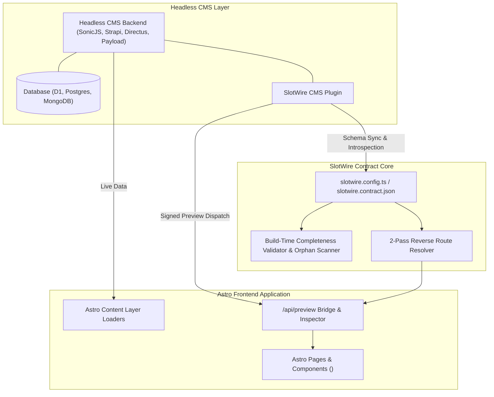

# SlotWire Architecture Specification

## 1. System Overview

SlotWire is a declarative 2-way contract engine and live preview bridge connecting modern frontend frameworks (Astro) with Headless CMS backends. It eliminates the "headless disconnect"—schema drift, blind CMS content modeling, and broken in-context preview workflows.



---

## 2. Core Subsystems

### A. Fluent Schema Contract Builder (`@slotwire/core`)
Frontend components declare their data requirements using fluent, Zod-backed contract builders:
* `s.object({...})`: Singletons, global settings, hero sections.
* `s.collection(name, {...})`: Repeatable collections, blogs, projects, services.
* `.previewRoute(pattern)`: Maps CMS collections to frontend URL routes using template strings (`/blog/{slug}`, `/#feature-bento`, `/{slug}`).

### B. 2-Pass Reverse Route Resolver
Translates incoming CMS requests (`collection`, `slug`, `id`) into precise frontend routes:
1. **Pass 1 (Exact Match)**: Matches exact collection keys (e.g. `blog_post` $\rightarrow$ `/blog/{slug}`, `blog_posts` $\rightarrow$ `/blog`).
2. **Pass 2 (Fuzzy Normalization)**: Normalizes casing, separators (`-`, `_`), and plural suffixes (`s`) to gracefully resolve aliases.
3. **Template Interpolation**: Replaces `{slug}` and `{id}` tokens with document values.

### C. Live In-Context Preview Bridge (`astro-slotwire`)
Served at `/api/preview`:
* Validates cryptographic preview tokens.
* Sets a secure `slotwire_preview=true` session cookie.
* Automatically executes in-browser HTTP probes to measure route health and latency.
* Embeds a live in-situ iframe preview alongside full-window dispatch buttons.
* Renders the underlying JSON contract configuration for real-time inspection.

### D. Build-Time Validator & Orphan Scanner
* **Completeness Check (`slotwire:check`)**: Verifies 100% of required visual slots are populated before deploying.
* **Orphan Content Scanner**: Flags ghost documents, dangling references, and dead R2 media assets.

---

## 3. Pure JSON Contract Format (Edge & Remote Sync)

Contracts are 100% JSON-serializable, allowing dynamic edge updates without code redeployments:

```json
{
  "version": "1.0.0",
  "cms": {
    "provider": "sonicjs",
    "apiUrl": "https://cms.brainendeavor.com"
  },
  "slots": {
    "blog_post": {
      "kind": "collection",
      "collectionName": "blog_post",
      "previewRoute": "/blog/{slug}"
    },
    "services": {
      "kind": "collection",
      "collectionName": "services",
      "previewRoute": "/#feature-bento"
    }
  }
}
```
In production, SlotWire can read this contract directly from Cloudflare R2 or KV (`env.SLOTWIRE_CONTRACT_JSON`).
