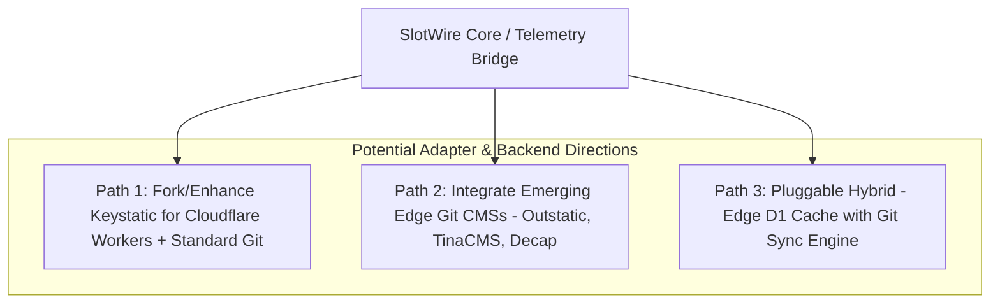

# SlotWire CMS Authoring Paradigms & Future Directions

This document serves as an architectural evaluation and strategic roadmap for how **SlotWire** interfaces with different CMS authoring paradigms. It evaluates Git-based CMSs (e.g., Keystatic, TinaCMS), database/edge CMSs (e.g., SonicJS + Cloudflare D1), and explores an ideal Cloudflare edge-native Git/R2 authoring architecture.

---

## 1. Comparing CMS Authoring Paradigms

| Dimension | 1. Direct Git / MDX | 2. Keystatic CMS | 3. Edge SQLite (SonicJS + D1) | 4. Ideal Headless / Git CMS Vision *(BrainEndeavor Perspective)* |
| :--- | :--- | :--- | :--- | :--- |
| **Target Author** | Developers only (CLI, VS Code, Git branching). | Content writers & devs via web UI within Astro. | Any user/editor on web browser (desktop, tablet, mobile). | Any author with in-situ live editing on the actual page. |
| **Storage Backend** | Git repository (Markdown / MDX files). | Git repository (Markdown / MDX / JSON). | Cloudflare D1 (Distributed SQLite at edge) + R2. | **Pluggable & Git-Backed**: Git repo (documents) + R2 edge publication cache. |
| **Hosting & Runtime** | Static site build (SSG). | React SPA bundled inside Astro; local mode or Keystatic Cloud. | Serverless Cloudflare Worker + D1 SQLite at edge. | Edge worker runtime (Cloudflare Workers / SSR) with incremental rendering. |
| **Editing Latency / Responsiveness (UX/EX)** | Instant local text editing in IDE, but high barrier to entry. | Fast local keystrokes, but sluggish in Cloud mode due to remote GitHub API roundtrips. | Variable; depends on CMS editor implementation and network latency to Worker/D1. | **Instant UX/DX/EX responsiveness**: Sub-second UI updates, optimistic client state, seamless editor. |
| **Drafting & Preview** | Run `npm run dev` locally. | Branch-based preview in GitHub / local dev. | **Sub-second edge SSR Live Preview** (`slotwire_preview=true`). | **Universal In-Situ Live Preview** across any backend with SlotWire HUD. |
| **Publishing Latency** | 1–3 min CI/CD rebuild on every git commit. | 1–3 min CI/CD rebuild on every GitHub commit. | **Instant (0 ms rebuild)**: Edge D1 update + cache purge (does not require full static site rebuild). | **Incremental Edge Update**: Git commit/tag triggers incremental R2 push; zero full rebuild. |
| **Git API Coupling** | Native Git CLI (`git commit`, `git push`). | Strongly coupled to **GitHub REST/GraphQL API** (or local FS). | Completely decoupled from Git (pure database). | **Standard Git Transport** (`git+https`, `isomorphic-git`, or libgit2) — agnostic of hosting platform. |

---

## 2. Evaluation of Git-Based CMSs & Keystatic

### The Appeal of Git-Based CMSs
1. **Single Source of Truth**: Content lives alongside code in version control, with full commit history, diffs, branching, and pull-request review workflows.
2. **Zero Database Infrastructure**: No separate SQL database to host, migrate, back up, or keep in sync with schema versions.
3. **Developer-Friendly**: Developers can edit content directly in markdown/MDX files with their favorite editor.

### Key Limitations & Friction Points with Current Tools (Keystatic)
1. **Local vs. Cloud Editing Dilemma**:
   - In *Local Mode*, Keystatic only works on `localhost` during development.
   - In *Production Cloud Mode*, it requires either Keystatic Cloud (a paid proprietary SaaS proxy) or a GitHub App integration with OAuth tokens.
2. **GitHub API Lock-In vs. Standard Git**:
   - Keystatic's cloud mode communicates directly with the GitHub REST/GraphQL API rather than using standard Git protocols (`git+ssh` / `git+https`).
   - This makes self-hosting (GitLab, Gitea, SourceHut, private bare repos) difficult or unsupported out of the box.
3. **Publishing Latency & Rebuild Bottlenecks**:
   - Every single content change committed to Git triggers a full Cloudflare Pages or Vercel rebuild (often 1–3 minutes). While build times are not as performance-critical as UX/DX/EX responsiveness during editing, slow builds hinder quick editorial validation unless paired with dynamic SSR preview.

---

## 3. Ideal Cloudflare Edge Architecture Vision (BrainEndeavor Perspective)

For teams building on Cloudflare's edge infrastructure, an ideal architecture combines the versioning guarantees of Git with the speed of edge workers:

1. **Strong SlotWire Contracts**: All content types (pages, sections, cards, blog posts, authors, FAQs) are strictly modeled via `@slotwire/core` schemas.
2. **Git-Backed Content Versioning**: Content documents are stored as structured files in Git, leveraging branches, tags, and commit history for content releases.
3. **Incremental Edge Publication via R2**:
   - Instead of a full static site rebuild on every commit, publishing a Git tag/version triggers an incremental sync of changed JSON/Markdown documents directly to a Cloudflare **R2 bucket** (or KV/D1 edge store).
   - Astro pages render statically from R2/edge buckets with edge cache invalidation.
4. **UX/DX/EX Responsiveness as Top Priority**:
   - Editorial responsiveness (saving drafts, viewing live in-situ previews, manipulating structured fields) must be instant (< 100ms).
   - Heavy Git operations or pipeline builds are handled asynchronously in the background.

---

## 4. Potential Future Directions for the SlotWire Ecosystem

### Path 1: Fork / Enhance Keystatic for Cloudflare Workers & Standard Git
- **Concept**: Adapt Keystatic's UI and schema engine to run serverless inside a Cloudflare Worker, replacing GitHub-specific API calls with standard Git transport (e.g. using `isomorphic-git` over HTTPS or edge workers with Git credentials).
- **Pros**: Retains Keystatic's polished rich text / MDX component editor; removes reliance on Keystatic Cloud.
- **Cons**: High initial maintenance burden; managing Git packfiles and memory constraints on edge workers.

### Path 2: Integrate / Benchmark Existing Headless Git CMSs
- **Candidates**:
  - **TinaCMS**: Rich in-context visual editing, Git-backed, supports GraphQL and Cloudflare/Vercel edge hosting.
  - **Decap CMS** (formerly Netlify CMS): Lightweight, mature Git-based CMS with open OAuth proxy support.
  - **Outstatic / StaticJs**: Next.js / Astro-friendly Git CMS frameworks.
- **Action**: Build experimental SlotWire adapters for TinaCMS and Decap to test authoring velocity and preview ergonomics.

### Path 3: Hybrid Architecture (Edge D1 Cache + Git Background Sync)
- **Concept**: Authors edit in a fast Edge CMS (sub-second D1 SQLite), while an automated background worker periodically serializes published documents into clean Markdown/MDX files and commits them to Git.
- **Pros**: Best of both worlds—instant zero-rebuild publishing for editors, with automated Git backups and version history for developers.

---

## 5. SlotWire's Boundary & Strategic Role

> [!IMPORTANT]
> **Pushback & Scope Boundary Directive**:
> - **SlotWire is strictly a Contract, Telemetry, and Visual In-Context Bridge — NEVER an ORM, data fetcher, or proprietary CMS backend.**
> - SlotWire stays **100% provider-agnostic** via the universal `SlotWireCmsAdapter` interface.
> - Whether a site chooses SonicJS (D1), Keystatic (GitHub), TinaCMS (Git GraphQL), or an R2-backed edge store, SlotWire enforces the schema contract, injects the visual in-situ HUD, and handles deep linking into the appropriate editor.

---

## 6. Next Steps & Exploration Sequence

1. **Complete Immediate Milestone**: Finalize model cleanup and generic fallback standardization in `brainendeavor.com`.
2. **Phase 2 Exploration**: Benchmark Keystatic, TinaCMS, and Edge Git engines in an isolated spike workspace.
3. **Phase 3 Adapter Extensions**: Formalize `@slotwire/adapter-git` and `@slotwire/adapter-sonicjs` in the `@slotwire` monorepo.
