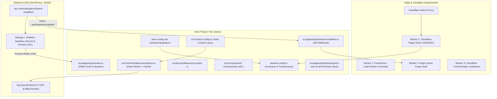

# SlotWire Astro & Edge Integration File Manifest

> **Purpose**: A comprehensive architectural index of all files, configurations, endpoints, and Cloudflare Worker deployments required to integrate SlotWire into an Astro project with a headless CMS (WordPress, SlottD, Directus).

---

## 1. Summary Architecture Map

---

## 2. Frontend / Astro Project Files

| File Path | Role & Purpose | Required / Optional | Key Contents / Exports |
| :--- | :--- | :--- | :--- |
| **`slotwire.config.ts`** | Central contract definition. Maps CMS provider, API endpoints, slot schemas, 1:1 transformers, and per-slot `quickEdit` flags. | **REQUIRED** | `defineContract({ cms, preview, slots: { ... } })` |
| **`astro.config.mjs`** | Astro configuration. Registers `@slotwire/astro` integration and edge SSR adapter (`@astrojs/cloudflare`). | **REQUIRED** | `integrations: [slotwireIntegration()]`, `adapter: cloudflare()` |
| **`src/content.config.ts`** | Astro 5 Content Layer configuration. Defines collections (`blog`, `pages`) with strict Zod contracts. | **REQUIRED** | `defineCollection({ loader: ..., schema: ... })` |
| **`src/content/loaders/wordpress.ts`** | Native Astro Content Layer loader. Fetches from `/wp-json/slotwire/v1/*` with request-scoped memoization and build cache. | **REQUIRED** (for WP) | `export function wordpressLoader(options)` |
| **`src/lib/slotwire-transformers.ts`** | Composable transformer helper blocks (`tx.cleanShortcodes`, `tx.pluck`, `tx.extractFirst`). | **RECOMMENDED** | `export const tx = { ... }` |
| **`src/layouts/BaseLayout.astro`** | Base layout mounting SlotWire context and in-situ visual badges for authenticated editors. | **REQUIRED** | `<SlotWireProvider config={config}><slot /></SlotWireProvider>` |
| **`src/components/**/*.astro`** | UI components wrapped with `<Slot name="...">` markers or `data-slot` telemetry attributes. | **REQUIRED** | `<Slot name="homepage_hero">...</Slot>` |
| **`src/pages/api/preview.ts`** | Preview auth endpoint. Validates HMAC-SHA256 signature from CMS, sets `slotwire_preview=true` session cookie. | **REQUIRED** (for Live Preview) | `export const GET: APIRoute = async ({ request, cookies })` |
| **`src/pages/api/slotwire/revalidate.ts`** | ISR revalidation webhook. Receives signed POST from CMS upon publishing, invalidates caches. | **REQUIRED** (for On-Demand ISR) | `export const POST: APIRoute = async ({ request })` |
| **`src/pages/api/slotwire/quick-save.ts`** | In-situ Quick Edit Drawer save handler for discrete 1:1 editable entities (posts, single pages). | **OPTIONAL** (if Quick Edit enabled) | `export const POST: APIRoute = async ({ request })` |
| **`src/middleware.ts`** | Astro middleware for request-scoped preview state detection and per-request cache invalidation. | **RECOMMENDED** | `onRequest = async ({ cookies, locals }, next)` |
| **`src/env.d.ts`** | TypeScript ambient definitions for SlotWire locals, environment variables, and image metadata. | **REQUIRED** | `interface Locals { slotwirePreview: boolean; }` |

---

## 3. Backend CMS Files & Configuration (WordPress)

| File / Screen | Role & Purpose | Key Configuration |
| :--- | :--- | :--- |
| **`wp-content/plugins/slotwire-headless/`** | Official WordPress companion plugin. Generates Gutenberg block ASTs and HMAC preview tokens. | Packed via `npm run build:zip` in `plugins/wordpress` |
| **`Settings > SlotWire Headless`** | WordPress Admin configuration page. | 1. **Frontend Preview URL**: `http://localhost:4321` (dev) or `https://preview.cadynorth.com` (prod) 2. **Secret Key**: Shared HMAC-SHA256 secret (matches `preview.secret` in `slotwire.config.ts`) |
| **REST Endpoints Exposed** | 1. `GET /wp-json/slotwire/v1/content/:type` 2. `POST /wp-json/slotwire/v1/content/:type/:id` 3. `GET /wp-json/slotwire/v1/meta/slots` | Delivers clean AST without `{ rendered: "..." }` nesting. |

---

## 4. Edge Infrastructure & Cloudflare Deployments

| Deployment Unit | Target Platform | Trigger / Route | Purpose & Implementation |
| :--- | :--- | :--- | :--- |
| **Worker 1: Astro Runtime** | Cloudflare Pages / Worker | `/*` (Primary frontend domain) | Hosts compiled static assets via edge cache; executes `@astrojs/cloudflare` SSR for dynamic preview (`slotwire_preview=true`). |
| **Worker 2: Form & Lead Capture** | Cloudflare Worker / Freeformer | `POST /api/contact`, `POST /api/book-inquiry` | Decouples legacy WPForms. Validates Cloudflare Turnstile tokens (invisible bot check); routes leads to Zapier/CRM/email. |
| **Worker 3: Edge Cache Revalidation Hook** | Cloudflare Worker or Astro API route | `POST /api/slotwire/revalidate` | Listens for HMAC-signed webhooks from WordPress; calls Cloudflare Cache API (`caches.default.delete(url)`) to purge stale HTML globally. |
| **Worker 4: Cloudflare Tunnel (`cloudflared`)** | DigitalOcean Droplet | Internal daemon (no public port) | Optional origin lockdown: Closes ports 80 and 443 on the Droplet completely. Only Cloudflare edge can route to `/wp-admin` and `/wp-json`. |

---

## 5. Environment Variables Manifest

| Variable Name | Environment | Description | Example Value |
| :--- | :--- | :--- | :--- |
| `CMS_PROVIDER` | Build & Runtime | Identifier for backing CMS | `wordpress` or `directus` |
| `CMS_API_URL` | Build & Runtime | Base URL of WordPress / CMS instance | `https://cadynorth.com` |
| `SLOTWIRE_PREVIEW_SECRET` | Runtime (SSR) | Shared HMAC-SHA256 secret for validating preview tokens | `sec_9f8a7b6c5d4e...` |
| `SLOTWIRE_WEBHOOK_SECRET` | Runtime (SSR) | Secret for authenticating on-demand ISR revalidation calls | `whsec_1a2b3c4d5e...` |
| `PUBLIC_SITE_URL` | Build & Runtime | Canonical frontend domain | `https://cadynorth.com` |
| `TURNSTILE_SECRET_KEY` | Runtime (Forms) | Cloudflare Turnstile server validation key | `0x4AAAAAA...` |
