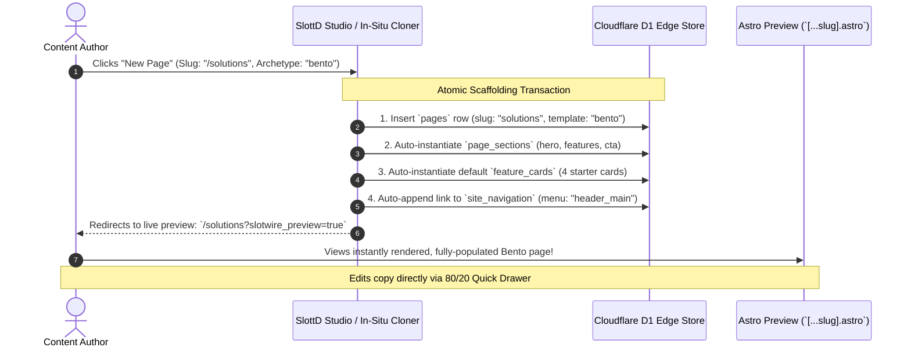
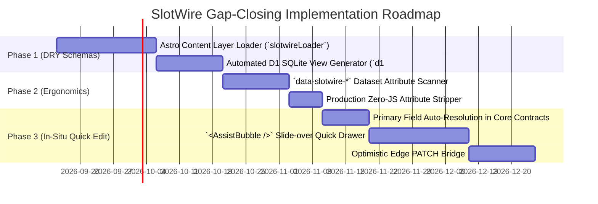

# SlotWire + SlottD: Pragmatic Positioning, Comparative Analysis & Gap-Closing Strategy

> **Core Philosophy**: SlotWire + SlottD does not exist to clone venture-backed, multi-million-dollar SaaS platforms like Storyblok, Contentful, or CloudCannon. We cannot—and should not—compete on infinite SaaS polish, real-time multi-cursor collaboration, or proprietary iframe canvas engines.
> 
> Instead, SlotWire + SlottD is an **open-source, edge-native, developer-first architecture** for Astro that delivers contract-safe authoring, instant previews, and sub-10ms performance at $0–$5/month. This document outlines how to realistically position this stack and pragmatically close the authoring experience gap.

---

## 1. Grounded Reality: SaaS vs. SlotWire + SlottD

| Dimension | Enterprise Headless SaaS (e.g. Storyblok, Contentful) | Git-Backed SaaS (e.g. CloudCannon) | SlotWire + SlottD Stack |
| :--- | :--- | :--- | :--- |
| **Business Model** | High monthly SaaS subscriptions ($100–$2,000+/mo), aggressive per-seat pricing, bandwidth tiers. | Per-seat / per-site SaaS subscriptions; proprietary sync runners. | **100% Open Source & Self-Hosted**. Infrastructure costs ~$0–$5/mo on Cloudflare Workers, D1, and R2. |
| **Data Storage** | Proprietary cloud database; vendor lock-in. | Flat Markdown / MDX / JSON files committed directly to Git. | **Hybrid Edge Relational + JSON (D1 SQLite)** with on-demand bi-directional Git sync (`slottd sync`). |
| **Preview Model** | Iframe bridge with real-time `postMessage` canvas updates. | Build-and-render or specialized preview runner. | **Instant sub-second Edge SSR bypass** (`slotwire_preview=true`) querying live `draft_data` in D1. |
| **Publishing Model** | Instant API change (requires webhook to rebuild SSG or dynamic SSR). | Full Git commit triggering 1–3 minute CI/CD static site rebuild. | **Instant 0ms D1 state transition** (promotes `draft_data` -> `data`) + optional automated Git release tag. |
| **Contract Integrity** | Loose runtime typing; empty or renamed fields silently break frontend UI until manual discovery. | Schema defined per frontmatter; limited cross-collection contract validation. | **Strict build-time contracts (`@slotwire/cli scan`)**, pre-publish verification pipelines, and Ghost wireframes for missing slots. |
| **Runtime Footprint** | Client-side SDK scripts and bridge bundles. | Editor scripts injected in preview/iframe. | **Zero KB of client JS in production**; inert semantic `data-slotwire-*` tags. |

---

## 2. Honest Friction Points & Gap Analysis

When evaluating the authoring experience of SlotWire + SlottD critically against market expectations, three primary friction points emerge:

### 🚨 Gap 1: The "Deep Link Jump" vs. "Instant Inline Edit" Expectation
* **The Reality**: Content creators today are accustomed to tools like Webflow, Notion, or Storyblok, where clicking a heading allows you to type directly on the page.
* **SlotWire's Current State**: Clicking an in-situ badge routes the user out of the Astro preview tab and into SlottD’s form-based MicroStudio (`/admin/content/:collection/:id`).
* **The Friction**: While deep-linking directly to the record is vastly superior to hunting through nested database menus, navigating away from the page just to fix a single typo or headline feels heavyweight for simple edits.

### 🚨 Gap 2: Schema Duplication & Content Modeling Fatigue
* **The Reality**: Astro 5 unified content handling with the **Content Layer** (`defineCollection({ loader: ..., schema: z.object(...) })`).
* **SlotWire's Current State**: Developers may find themselves declaring:
  1. Zod schemas in Astro's `src/content.config.ts`,
  2. Fluent contracts in `slotwire.config.ts`, and
  3. Relational views / tables in SlottD (`slottd/migrations/` or dynamic views).
* **The Friction**: Maintaining contracts in multiple places introduces mental overhead and schema drift. While AI assistants can write this boilerplate, clean and DRY architecture remains essential.

### 🚨 Gap 3: Template Intrusion (`<SlotWire />` Wrappers)
* **The Reality**: Astro developers prize the framework for its clean, HTML-first component ergonomics.
* **SlotWire's Current State**: Wrapping sections in `<SlotWire slot="hero" archetype="section" data={hero}>...</SlotWire>` adds JSX nesting and component imports across page templates.

---

## 3. Strategies to Close the Gaps

We do not need to rebuild Storyblok to deliver an exceptional developer and editor experience. By focusing on high-leverage 80/20 solutions, we can drastically reduce friction while retaining our core architectural advantages.

```
┌─────────────────────────────────────────────────────────────────────────────┐
│                      THE 3-TIER GAP CLOSING STRATEGY                        │
├─────────────────────────────────────────────────────────────────────────────┤
│ 1. Streamlined Content Modeling: Native Astro Content Layer Loader          │
│    `slotwireLoader()` derives Astro collection schemas directly from        │
│    `slotwire.config.ts`. Zero duplicate schema definitions.                 │
├─────────────────────────────────────────────────────────────────────────────┤
│ 2. Dual Tagging Ergonomics: `<SlotWire />` OR `data-slotwire-*`             │
│    Allow developers to use standard HTML dataset attributes on existing     │
│    markup without importing wrapper components.                             │
├─────────────────────────────────────────────────────────────────────────────┤
│ 3. 80/20 Instant Inline Editing: The Assist Drawer / Micro-Modal            │
│    Automate the "primary" field in archetypes. Clicking an Assist badge     │
│    opens a lightweight on-page modal for instant copy edits, with a link    │
│    to SlottD Studio for complex structural changes.                         │
└─────────────────────────────────────────────────────────────────────────────┘
```

---

### Strategy 1: Streamlined Content Modeling via Native `slotwireLoader()`

Instead of asking developers to define Zod schemas in `src/content.config.ts` and repeat them in `slotwire.config.ts`, SlotWire will expose a native **Astro Content Layer Loader**:

```typescript
// src/content.config.ts (Astro 5)
import { defineCollection } from 'astro:content';
import { slotwireLoader } from 'astro-slotwire';
import slotwireConfig from '../slotwire.config';

// Automatically derives Zod schema and fetches data via SlottD/Directus SDK
export const collections = {
  posts: defineCollection({
    loader: slotwireLoader({
      config: slotwireConfig,
      collection: 'posts',
    }),
  }),
  pages: defineCollection({
    loader: slotwireLoader({
      config: slotwireConfig,
      collection: 'pages',
    }),
  }),
};
```

#### Why This Closes the Gap:
1. **Single Source of Truth**: `slotwire.config.ts` defines the contract once. Astro's Content Layer automatically inherits the typed schema.
2. **Automated SlottD View Generation**: `@slotwire/cli` can inspect `slotwire.config.ts` and generate the SQLite dynamic `CREATE VIEW` statements for SlottD D1 automatically (`npx slotwire d1:sync`), completely eliminating manual database modeling.
3. **AI Synergy**: When AI generates or updates an archetype in `slotwire.config.ts`, both the Astro frontend loader and the edge database schema update deterministically.

---

### Strategy 2: Flexible Tagging Ergonomics (`data-slotwire-*` vs. `<SlotWire />`)

A common concern is whether transitioning from `<SlotWire />` component wrappers to native `data-slotwire-*` attributes sacrifices functionality. **In practice, there is virtually zero functional loss for populated content**:
* `<AssistBubble />` can run `document.querySelectorAll('[data-slotwire-slot]')` on the live preview and dynamically mount the exact same hover outlines, corner badges, composite popovers, and Quick Edit modals.
* Build auditors (`slotwire scan`) can inspect dataset attributes via HTML/AST parsers just as effectively.
* **The Single Edge Case (Missing Data)**: `<SlotWire />` can act as an Astro component boundary to catch `data={undefined}` and render an inline visual wireframe (`<GhostSlot>`). With `data-slotwire-*`, if a template conditionally hides a missing section (`{hero && <section data-slotwire-...>}`), the DOM node simply isn't rendered. However, `<AssistBubble />` already knows which slots *should* exist from `slotwire.config.ts`, so it simply flags the missing slot in its floating drawer checklist.

> [!NOTE]
> **Priority Verdict**: Because `data-slotwire-*` can achieve complete parity without JSX noise, **Strategy 1 (Content Modeling & DRY Loaders) and Strategy 3 (80/20 Quick Modal) are our primary architectural priorities**. Strategy 1 solves developer fatigue, while Strategy 3 solves editor perception.

---

### Strategy 3: The 80/20 On-Page Micro-Editor (Instant Edits)

The vast majority (~80%) of day-to-day visual edits do not involve restructuring entire database relations—they are **quick text corrections, headline updates, button CTA tweaks, or image replacements**.

Instead of a complex full-page iframe canvas, SlotWire’s `<AssistBubble />` authoring bundle will provide a **Lightweight In-Situ Quick Drawer**:

```
┌─────────────────────────────────────────────────────────────┐
│  LIVE PREVIEW (Astro Staging)                               │
│                                                             │
│   ┌───────────────────────────┐    ┌────────────────────┐   │
│   │ Hero Title                │    │ ⚡ Quick Edit       │   │
│   │ "Next Gen Edge Websites"  │    ├────────────────────┤   │
│   │ [⚡ Edit] [↗ Full Studio] │───>│ Title (Primary):   │   │
│   └───────────────────────────┘    │ [ Next Gen Edge..] │   │
│                                    │ Description:       │   │
│                                    │ [ Blazing fast...] │   │
│                                    │                    │   │
│                                    │ [ Save Draft (0ms)]│   │
│                                    │ ↗ Open SlottD Studio│   │
│                                    └────────────────────┘   │
└─────────────────────────────────────────────────────────────┘
```

#### How It Works:
1. **Automated Primary Field Detection**: In `slotwire.config.ts`, archetypes declare or auto-infer the primary display fields (e.g. `title`, `headline`, `subhead`, `ctaText`).
2. **In-Situ Drawer**: Clicking the `[⚡ Edit]` button on any slot overlay opens a lightweight, slide-over drawer rendered directly inside the staging environment.
3. **Sub-Second Edge PATCH**: Editing a field and clicking "Save" issues a direct `PATCH /items/:collection/:id` to SlottD’s edge API. 
4. **Optimistic DOM Update**: The DOM updates immediately, and Astro's SSR preview revalidates in `< 200ms`.
5. **Escape Hatch**: A prominent **"Open Full Studio in SlottD ↗"** button remains for complex tasks (repeater items, media uploads, multi-column layouts, publishing workflows).

#### Why This Closes the Gap:
* Delivers the instant gratification of Storyblok without needing a heavy iframe postMessage synchronization engine.
* Resolves the "jump away" friction for the most frequent editorial tasks.

---

## 4. Deep Dive: How Astro Models Pages & The "New Page" Architecture

One of the most persistent sources of confusion in headless architectures is the **"New Page" workflow**. To solve this cleanly, we must understand how Astro natively models pages and templates, why traditional headless CMSs fail at this, and how SlotWire + SlottD provides a deterministic model.

---

### How Astro Natively Models Pages and Routing

Astro uses strict **file-based routing** powered by the `src/pages/` directory:

1. **Explicit Static Routes**:
   * `src/pages/index.astro` $\rightarrow$ `/`
   * `src/pages/about.astro` $\rightarrow$ `/about`
   * If a site relies strictly on individual `.astro` files, **a non-technical editor can never create a new page in a CMS**—every new route requires a developer to write and commit a new `.astro` file.

2. **Dynamic Catch-All Routes (`src/pages/[...slug].astro`)**:
   * To allow the CMS to drive page creation, Astro applications use dynamic route parameters.
   * In **SSG mode** (`output: 'static'`), Astro requires `getStaticPaths()`:
     ```astro
     export async function getStaticPaths() {
       const pages = await getCollection('pages');
       return pages.map(page => ({
         params: { slug: page.slug === 'home' ? undefined : page.slug },
         props: { page },
       }));
     }
     ```
   * In **SSR mode** or during **live preview** (`slotwire_preview=true`), `src/pages/[...slug].astro` runs dynamically per request, querying the CMS at the edge based on `Astro.params.slug`.

3. **Layouts vs. Templates vs. Section Components**:
   Astro does not have a formal CMS-style "Page Template" primitive out of the box. Instead, the convention breaks down into three distinct layers:
   * **Layouts** (`src/layouts/BaseLayout.astro`): The HTML skeleton (`<html>`, `<head>`, SEO metadata, global header navigation, global footer, and `<slot />`).
   * **Route Controller** (`src/pages/[...slug].astro`): Fetches the page document and dynamic sections from the Content Layer, and dynamically renders the chosen template.
   * **Page Templates** (`src/components/templates/*.astro`): Pre-configured layout archetypes (e.g. `BentoTemplate.astro`, `NarrativeTemplate.astro`, `LegalTemplate.astro`) that arrange visual slot components.

---

### Why the "New Page" Workflow Fails in Traditional Headless CMSs

When a marketing user in WordPress, Squarespace, or Webflow clicks "Create New Page", the page exists instantly with pre-populated starter blocks and an assigned URL. 

In decoupled headless setups, this workflow typically breaks down due to four disconnects:

```
┌─────────────────────────────────────────────────────────────────────────────┐
│                 THE 4 FAILURES OF HEADLESS PAGE CREATION                    │
├─────────────────────────────────────────────────────────────────────────────┤
│ 1. The Blank Page Syndrome:                                                 │
│    Creating a `pages` row doesn't create its child sections. Visiting the   │
│    new URL renders an empty void or throws undefined runtime errors.        │
├─────────────────────────────────────────────────────────────────────────────┤
│ 2. Foreign Key & Composite Identity Fatigue:                                │
│    The editor must navigate to `page_sections`, manually type the foreign   │
│    key `pageSlug="contact"` and `sectionKey="hero"`, then repeat for cards. │
├─────────────────────────────────────────────────────────────────────────────┤
│ 3. Template Dispatch Ambiguity:                                             │
│    The CMS has no contract stating which Astro template component should    │
│    render the page, or what slots that template expects.                    │
├─────────────────────────────────────────────────────────────────────────────┤
│ 4. Navigation Orphanage:                                                    │
│    The page is created in the database, but no visitor can reach it because │
│    it is not hooked into the header or footer menu system.                  │
└─────────────────────────────────────────────────────────────────────────────┘
```

---

### The Canonical SlotWire + SlottD "New Page" Solution

SlotWire resolves this by treating a "New Page" not as an isolated database row, but as an **Atomic Archetype Bundle**:



#### 1. The Standardized Astro Route Dispatcher (`src/pages/[...slug].astro`)
Astro developers configure one universal route handler with a clean template registry:

```astro
---
// src/pages/[...slug].astro
import BaseLayout from '@/layouts/BaseLayout.astro';
import BentoTemplate from '@/components/templates/BentoTemplate.astro';
import NarrativeTemplate from '@/components/templates/NarrativeTemplate.astro';
import StandardTemplate from '@/components/templates/StandardTemplate.astro';
import { getEntry } from 'astro:content';

const templates: Record<string, any> = {
  bento: BentoTemplate,
  narrative: NarrativeTemplate,
  standard: StandardTemplate,
};

const slugParam = Astro.params.slug;
const pageSlug = (!slugParam || slugParam === '/') ? 'home' : slugParam.replace(/^\/+|\/+$/g, '');

// Query page via Astro Content Layer (backed by slotwireLoader)
const page = await getEntry('pages', pageSlug);

if (!page) {
  return Astro.redirect('/404');
}

const templateKey = page.data.template || 'standard';
const ActiveTemplate = templates[templateKey] || StandardTemplate;
---

<BaseLayout title={page.data.title} description={page.data.description}>
  <ActiveTemplate page={page} />
</BaseLayout>
```

#### 2. Archetype Declaration in `slotwire.config.ts`
The contract defines the child slot hierarchy and starter scaffolding:

```typescript
// slotwire.config.ts
export default defineContract({
  archetypes: {
    bento: s.page({
      template: 'bento',
      description: 'Bento Grid marketing layout with hero and feature cards',
      slots: {
        hero: s.section({ key: 'hero', defaultTitle: 'New Page Hero' }),
        features: s.section({
          key: 'features',
          children: s.collection('feature_cards', { defaultCount: 4 }),
        }),
        cta: s.section({ key: 'cta', defaultTitle: 'Get Started Today' }),
      },
    }),
  },
  navigation: s.navigation({
    collection: 'site_navigation',
    menus: ['header_main', 'footer_primary'],
  }),
});
```

#### 3. Atomic Scaffolding Endpoint in SlottD (`POST /ext/archetype/scaffold`)
When an editor clicks "Create Page" in SlottD Studio or uses the in-situ Pre-Create Cloner:
1. SlottD reads the archetype definition from the contract.
2. In a single SQLite transaction, SlottD creates the `pages` record, the matching `page_sections` records, and starter collection cards with foreign keys pre-bound (`pageSlug: "solutions"`).
3. The editor is immediately redirected to the Astro live preview. **The page is never blank, the schema is never invalid, and the author can immediately begin editing copy.**

---

## 5. How to Realistically Sell What We Offer

When presenting SlotWire + SlottD to developers, agencies, and technical founders, we position around four clear, defensible pillars:

### 1. Cost & Infrastructure Freedom ($0–$5/mo vs. Hundreds in SaaS)
* **The Pitch**: *"Why pay $200–$1,000/month to Storyblok or Contentful for marketing sites when you can run on your own Cloudflare Workers, D1, and R2 for pennies with sub-millisecond edge response times?"*
* **Target Audience**: Freelancers, digital agencies managing dozens of client sites, and lean startups who reject ongoing SaaS subscription overhead.

### 2. The Anti-Breakage Contract Engine (Fail-Fast CI/CD)
* **The Pitch**: *"Traditional headless CMSs let editors break production pages by omitting fields or renaming models. SlotWire guarantees schema integrity at build time (`npx slotwire scan`) and pre-publish (`onBeforePublish`), preventing broken layouts from ever reaching visitors."*
* **Target Audience**: Engineering leads and QA teams frustrated by silent headless frontend failures.

### 3. Edge-Native Speed with a Git Exit Strategy
* **The Pitch**: *"Get the sub-second save-and-preview speed of edge SQLite (D1) without being trapped in a database silo. SlottD allows you to export your entire content database back to clean Markdown frontmatter in Git with one command (`slottd sync`)."*
* **Target Audience**: Teams that love Git-backed transparency (Keystatic/Decap) but hate waiting 2–3 minutes for CI/CD builds just to preview a draft.

### 4. Pluggable CMS Agnosticism
* **The Pitch**: *"SlotWire is an open contract layer, not a closed CMS monopoly. Use SlottD today; if you ever need Strapi, Directus, or Keystatic tomorrow, your Astro components and contracts don’t have to change."*
* **Target Audience**: Agencies building multiple Astro projects across varied client requirements.

---

## 6. Implementation Roadmap & Next Steps



### Key Milestones:
1. **Phase 1: DRY Content Layer**: Implement `slotwireLoader()` so `src/content.config.ts` consumes `slotwire.config.ts` with zero schema duplication.
2. **Phase 2: Tagging Flexibility**: Ensure `<AssistBubble />` works identically whether elements use `<SlotWire />` or `data-slotwire-*` attributes.
3. **Phase 3: The 80/20 Quick Edit Drawer**: Launch the slide-over modal for instant on-page headline/copy edits with sub-second PATCH updates to SlottD.
