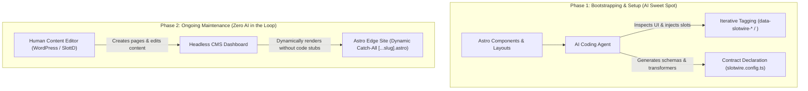

# SlotWire AI Agent Guide & Operating Manual

> **Purpose**: This guide is written specifically for AI coding agents and systems engineers building or bootstrapping websites using **SlotWire**, **Astro**, and headless CMS providers (WordPress, SlottD, Directus, SonicJS). It defines the architectural philosophy, strict operating guardrails, and practical patterns required to produce robust, zero-regression implementations.

---

## 1. The Division of Responsibilities: AI vs. Systems vs. Editors

The relationship between AI coding agents, the SlotWire framework, and human content editors is strictly divided:



### 1.1 What AI Agents SHOULD Do
* **Rapid Ad-Hoc Tag Discovery**: Inspect Astro components (`Hero.astro`, `BentoGrid.astro`, `PressBar.astro`), identify where static props and copy live, and iteratively inject SlotWire semantic attributes (`data-slotwire-slot`, `data-slotwire-collection`, `<SlotWire />`).
* **Contract Assembly**: Declare the contract in `slotwire.config.ts`, specifying field schemas, validation rules, and 1:1 slot transformers (`tx.cleanShortcodes()`, `tx.pluck()`).
* **Gateway Wiring**: Ensure the site has a single, clean dynamic catch-all route (`src/pages/[...slug].astro`) connected to the navigation contract and archetype templates.

### 1.2 What AI Agents MUST NOT Do
* **Zero Ongoing Content Maintenance**: Once a site is wired, editors add pages, write posts, and arrange navigation in the CMS. AI agents must **never** be required to stub new `.astro` page files or write boilerplate for routine content changes.
* **No Ad-Hoc Model Invention**: Never take liberties by inventing bizarre, unmaintainable database models for every page variation.
* **No Cross-Boundary Schema Pollution**: Never augment shared, standard archetypes with page-specific fields (e.g., shoving `founderName` into a universal `pages` table).

---

## 2. The Four Non-Negotiable Model & Archetype Guardrails

When modeling content for headless CMSs (SlottD, WordPress, Directus), AI agents must adhere strictly to these four guardrails:

### Guardrail 1: Standard Packs are Immutable
Standard storage packs (such as `@slottd/pack-slotwire`) represent universal, shared infrastructure.
* **Rule**: NEVER mutate or add page-specific fields (such as `founderName`, `founderRole`, `careerHighlights`, `bookCoverUrl`) to generic collections (`pages`, `page_sections`, `feature_cards`).
* **Rationale**: Augmenting generic models pollutes every other downstream site consuming that pack (e.g. `spectragql.dev` inheriting `founderName` from `brainendeavor.com`).

### Guardrail 2: Pages are Just Pages
* **Rule**: The `pages` collection is strictly a top-level **routing, layout selection, and SEO metadata container** (`title`, `slug`, `subtitle`, `description`, `template`, `status`).
* **Distinction**: A page with unique content is **NOT** a new page model. An "About" page with a founder bio is just a standard page that happens to display a custom content slot. Almost never create custom page collections.

### Guardrail 3: Standard Slots First; Isolated Custom Models for Bespoke Slots
When mapping visual components to CMS models:
1. **Use Standard Primitives (90% of Use Cases)**:
   * Single banner/section $\rightarrow$ `page_sections` (keyed by `pageSlug` + `sectionKey`).
   * Repeating grids/cards $\rightarrow$ `feature_cards` (keyed by `pageSlug` + `sectionKey`).
   * Image/media collections $\rightarrow$ `gallery` (keyed by `galleryKey` + `pageSlug`).
   * Social proof $\rightarrow$ `endorsements` or `testimonials`.
   * Accordions/FAQs $\rightarrow$ `qa_items`.
2. **Dedicated Models for Truly Bespoke Slots (10% of Use Cases)**:
   * If a slot has a genuinely unique schema that does not fit standard primitives (e.g. Founder Profile with timeline, Interactive Loan Calculator, Solar Panel Spec Table), **create a dedicated site-specific model** in that site's local configuration:
     ```typescript
     // slottd.config.ts (Site-specific configuration)
     collections: {
       founder_profile: {
         name: 'founder_profile',
         displayName: 'Founder Profile & Career Timeline',
         fields: [
           { name: 'fullName', type: 'TEXT', required: true },
           { name: 'role', type: 'TEXT' },
           { name: 'bio', type: 'TEXT', widget: 'markdown' },
           { name: 'timeline', type: 'JSON' },
         ],
       },
     }
     ```
   * **The Boundary**: The custom model lives exclusively in the local site's configuration. The shared `@slottd/pack-slotwire` remains 100% pristine.

### Guardrail 4: Precision & Contract Integrity (Fail Fast & Hard)
* **Zero Heuristic Fallbacks**: Never introduce silent fallback strings, dummy slugs, guesswork default templates, or silent bounces to `/` when a contract lookup fails.
* **Fail Immediately**: If a slot, collection, route template, document slug, or contract definition is missing, misnamed, unmapped, or invalid, **FAIL IMMEDIATELY** with an explicit, high-visibility error message.

---

## 3. SlotWire Scope & Architectural Boundaries

### 3.1 Data Client Boundary (No ORMs in SlotWire)
* **SlotWire is strictly a Contract, Telemetry, and Visual In-Context Bridge — NEVER an ORM or generic data-query client.**
* **Where Data Fetching Belongs**: Data fetching and caching live natively in the frontend framework (e.g., Astro Content Layer loaders, typed fetchers like `src/lib/wordpress-client.ts` or `src/lib/sonicjs.ts`).
* **Push Back Firmly**: Do not introduce generic CMS data-querying, caching, or fetching wrappers into `@slotwire/core` or `@slotwire/astro`. SlotWire consumes provided data to enforce schema contracts and inject in-situ UI/telemetry, leaving data transport to native frontend tools.

### 3.2 Strict 1:1 Slot-to-Transformer Model
* **Never create 1:Many Transformer-to-Slot Machinery**: Do not build complex orchestration that attempts to split one transformer across multiple slots.
* **1:1 Pairings**: Every slot that requires data cleaning or projection has **exactly one succinct transformer** (`homepage_hero` $\leftrightarrow$ `heroTransformer`).
* **Shared Data Layer Deduplication**: When multiple slots draw from the same underlying CMS document (e.g. a monolithic WordPress page), the data fetching client deduplicates and memoizes the request. Each slot transformer then succinctly plucks only the fields it requires.

### 3.3 The 80/20 Rule for In-Situ Quick Drawers
* **Explicit Intent in Config**:
  ```typescript
  slots: {
    homepage_hero: s.section({
      key: 'homepage_hero',
      collection: 'pages',
      ui: {
        quickEdit: false, // 80/20 rule: edit full composite page in CMS Admin
      },
    }),
  }
  ```
* **Always Maintain Deep Linking**: Disabling `quickEdit` must NEVER disable deep-linking. Clicking the in-situ badge on a complex composite slot redirects directly to the native CMS editing screen (`buildAdminLink`, e.g. `/wp-admin/post.php?post=7&action=edit`).
* **Why**: The in-situ Quick Drawer is designed for discrete 1:1 content entities (posts, standalone pages, singletons). Never risk corrupting a complex monolithic CMS layout by reverse-patching AST slices in an in-situ drawer.

---

## 4. Composable Transformer Building Blocks (`tx.*`)

When migrating legacy CMS content (e.g., WordPress visual builders, ACF, complex Gutenberg trees), do not write one-off regex hacks. Use composable, declarative transformer blocks:

```typescript
import { s, type SlotTransformer } from '@slotwire/core';

export const tx = {
  /**
   * Strips or unwraps visual builder shortcodes (Divi [et_pb_*], Elementor, WPBakery)
   * while preserving semantic HTML tags (<p>, <h2>, <a>, <ul>).
   */
  cleanShortcodes: (options?: { unwrapOnly?: string[]; removeTags?: string[] }): SlotTransformer => {
    return (rawDoc) => {
      if (typeof rawDoc?.content === 'string') {
        rawDoc.content = rawDoc.content
          .replace(/\[\/?et_pb_[^\]]*\]/g, '')
          .replace(/\[\/?wpforms[^\]]*\]/g, '')
          .trim();
      }
      return rawDoc;
    };
  },

  /**
   * JQ/JSONPath-style lens extractor for nested fields
   */
  pluck: (path: string, fallback: any = null): SlotTransformer => {
    const keys = path.split('.');
    return (rawDoc) => {
      let curr = rawDoc;
      for (const k of keys) {
        if (curr == null) return fallback;
        curr = curr[k];
      }
      return curr ?? fallback;
    };
  },

  /**
   * Functional pipe for composing multiple transformers cleanly
   */
  compose: (...fns: SlotTransformer[]): SlotTransformer => {
    return (rawDoc, ctx) => fns.reduce((acc, fn) => fn(acc, ctx), rawDoc);
  },
};
```

---

## 5. Universal Page Creation & Dynamic Route Gateway

To eliminate the need for AI agents or developers to stub new `.astro` route files for every page, the site implements a single, high-performance universal dynamic route gateway:

```astro
---
// src/pages/[...slug].astro
import BaseLayout from '@/layouts/BaseLayout.astro';
import StandardPageTemplate from '@/components/templates/StandardPageTemplate.astro';
import BentoLandingTemplate from '@/components/templates/BentoLandingTemplate.astro';
import ServiceDetailTemplate from '@/components/templates/ServiceDetailTemplate.astro';
import { getCollection, getEntry } from 'astro:content';

// 1. Static Build Generation (SSG)
export async function getStaticPaths() {
  const pages = await getCollection('pages');
  return pages.map((page) => ({
    params: { slug: page.slug === 'home' ? undefined : page.slug },
    props: { page },
  }));
}

// 2. Dynamic Route Resolution (SSR & Live Preview)
const slugParam = Astro.params.slug;
const pageSlug = (!slugParam || slugParam === '/') ? 'home' : slugParam.replace(/^\/+|\/+$/g, '');

let page = Astro.props.page;
if (!page) {
  page = await getEntry('pages', pageSlug);
}

if (!page) {
  return Astro.redirect('/404');
}

// 3. Template Dispatcher
const templateRegistry: Record<string, any> = {
  standard: StandardPageTemplate,
  bento: BentoLandingTemplate,
  service: ServiceDetailTemplate,
};

const templateKey = page.data.template || 'standard';
const ActiveTemplate = templateRegistry[templateKey] || StandardPageTemplate;
---

<BaseLayout title={page.data.title} description={page.data.description} pageSlug={pageSlug}>
  <ActiveTemplate page={page} />
</BaseLayout>
```

### The Autonomous Editorial Workflow (No Developer in the Loop)
1. **Editor Action**: A content creator opens the CMS (WordPress or SlottD Studio) and clicks **+ Add New Page**.
2. **Template Selection**: They assign a Template (e.g. `Bento Landing` or `Standard Page`), input their content, and check **"Add to Header Menu"**.
3. **Automatic Rendering**: When published, Astro’s `[...slug].astro` receives the route, matches the template, renders the assigned components, and injects the new page into the navigation contract.
4. **Result**: Zero code changes. Zero AI re-engagement.

---

## 6. Summary Checklist for AI Agents

Before submitting code changes on any SlotWire-enabled project, verify:

- [ ] **Standard Pack Purity**: Did you ensure `@slottd/pack-slotwire` was NOT modified with site-specific fields?
- [ ] **Page Model Integrity**: Did you keep `pages` strictly as a routing and metadata container without inventing custom page types?
- [ ] **Custom Slot Isolation**: If a truly unique component was required, is its custom model defined in the local site configuration rather than a shared pack?
- [ ] **Ad-Hoc Tag Discovery**: Did you inspect the Astro components and cleanly inject `data-slotwire-*` or `<SlotWire />` tags?
- [ ] **Fail Fast**: Did you avoid heuristic fallbacks, silent default strings, or guess-work slugs?
- [ ] **Boundary Check**: Did you leave data fetching in Astro Content Layer loaders instead of wrapping queries in SlotWire?
- [ ] **1:1 Transformers**: Are all transformers strictly 1:1 with slots?
- [ ] **80/20 In-Situ Pragmatism**: Are composite slots configured with `ui: { quickEdit: false }` while preserving CMS deep links?
- [ ] **Editorial Autonomy**: Can an editor create a new page in the CMS using existing archetypes without requiring an AI agent to stub a new route file?
