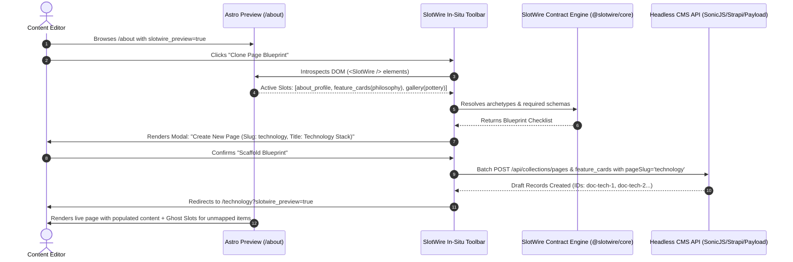

# SlotWire "Pre-Create" (Visual Archetype Cloner) Specification & Feasibility

## 1. Executive Summary & Problem Statement

In traditional Headless CMS workflows, creating a new page requires editors to:
1. Navigate to a backend admin UI decoupled from the website.
2. Guess which collections, singletons, and relation tables are needed to assemble a specific layout.
3. Manually populate foreign keys (e.g. `sectionKey`, `pageSlug`) without immediate feedback.
4. Attempt to trigger preview URLs hoping the route resolves correctly.

The **SlotWire "Pre-Create" (Visual Archetype Cloner)** reverses this mental model:
> **An editor browsing the live Astro site in preview mode can click "Create Page Like This" directly on any page.**

SlotWire inspects the page's active `<SlotWire />` slot declarations, translates the visual structure into a deterministic **Content Blueprint**, scaffolds the minimal required CMS draft records in one atomic batch, and redirects the editor to the new URL with live interactive ghost wireframes.

---

## 2. Technical Feasibility Assessment: 100% Feasible

| Subsystem Requirement | Status | Enabling Architecture |
| :--- | :--- | :--- |
| **In-Situ Page Introspection** | **Trivial** | `<SlotWire slot="..." />` components tag the DOM with `data-slotwire-slot="..."`. The client script (`astro-slotwire/client.ts`) aggregates all active slots in a single DOM traversal. |
| **Blueprint Calculation** | **Deterministic** | SlotWire contracts (`slotwire.config.ts`) define the exact schema, collection mapping, and reverse-route templates (`/{slug}`, `/{pageSlug}#gallery`). |
| **Ghost Slot Rendering** | **Straightforward** | In preview mode (`slotwire_preview=true`), unpopulated slots render interactive visual wireframes (*"UNPOPULATED SLOT: feature_cards — Click to Add Card"*) instead of throwing errors or collapsing layouts. |
| **One-Click CMS Batch Scaffolding** | **High Velocity** | `SlotWireCmsAdapter` executes atomic `POST` requests to the CMS API (`/api/collections/{collection}/content`) using the newly specified `pageSlug`. |

---

## 3. High-Level Architecture & Interaction Flow



---

## 4. Key Subsystems & User Experience

### A. The In-Situ "Pre-Create" Modal
```
┌─────────────────────────────────────────────────────────────┐
│ ⚡ SlotWire Visual Page Scaffolder                          │
│ Source Template: /about                                      │
├─────────────────────────────────────────────────────────────┤
│ New Page Details:                                           │
│ Title: [ Technology & Architecture                        ] │
│ Slug:  [ technology                                       ] │
│                                                             │
│ Blueprint Blueprint Checklist:                              │
│  [✓] Master Page Container (pages: 'technology')            │
│  [✓] Hero / Profile Section (page_sections: 'hero')         │
│  [✓] 4x Multi-Column Cards  (feature_cards: 'stack')        │
│  [ ] Media Gallery Set      (gallery: 'hardware') [Optional]│
├─────────────────────────────────────────────────────────────┤
│ [ Cancel ]                        [ 🚀 Scaffold & Edit Live ] │
└─────────────────────────────────────────────────────────────┘
```

### B. Interactive Ghost Slot Wireframes ("NO CONTENT HERE")
When an editor creates a new page route or browses an incomplete page, SlotWire prevents layout collapse:

```astro
<!-- SlotWire Ghost Component Rendering -->
<div class="slotwire-ghost-slot rounded-2xl border-2 border-dashed border-primary-500/40 bg-primary-500/5 p-8 text-center">
  <div class="inline-flex p-2 rounded-lg bg-primary-500/10 text-primary-500 mb-3">
    <Icon name="tabler/layout-grid-add" class="size-6" />
  </div>
  <h4 class="text-sm font-bold text-primary-600 dark:text-primary-400">UNPOPULATED SLOT: feature_cards</h4>
  <p class="text-xs text-base-500 mt-1">Section Key: "stack" • Target Route: /technology</p>
  <a href="https://cms.brainendeavor.com/admin/collections/feature_cards/new?pageSlug=technology&sectionKey=stack" target="_blank" class="mt-4 inline-flex items-center gap-1.5 rounded-lg bg-primary-600 px-3 py-1.5 text-xs font-semibold text-white hover:bg-primary-500">
    + Add First Card in CMS
  </a>
</div>
```

---

## 5. Next Steps for Implementation in `@slotwire/astro` & `@slotwire/core`

1. **Introspection Registry**: Expose `window.__SLOTWIRE_ACTIVE_SLOTS__` via `<SlotWire />` hydration script.
2. **Preset Blueprint Generator**: Add `generateBlueprint(contract, slotKeys, newSlug)` to `@slotwire/core`.
3. **Ghost Slot Fallback**: Update `SlotWire.astro` to render the ghost component when `required={true}` and `data` is empty in preview mode.
4. **CMS Adapter Scaffolder**: Add `scaffoldBlueprint(blueprint, credentials)` to `SlotWireCmsAdapter`.
