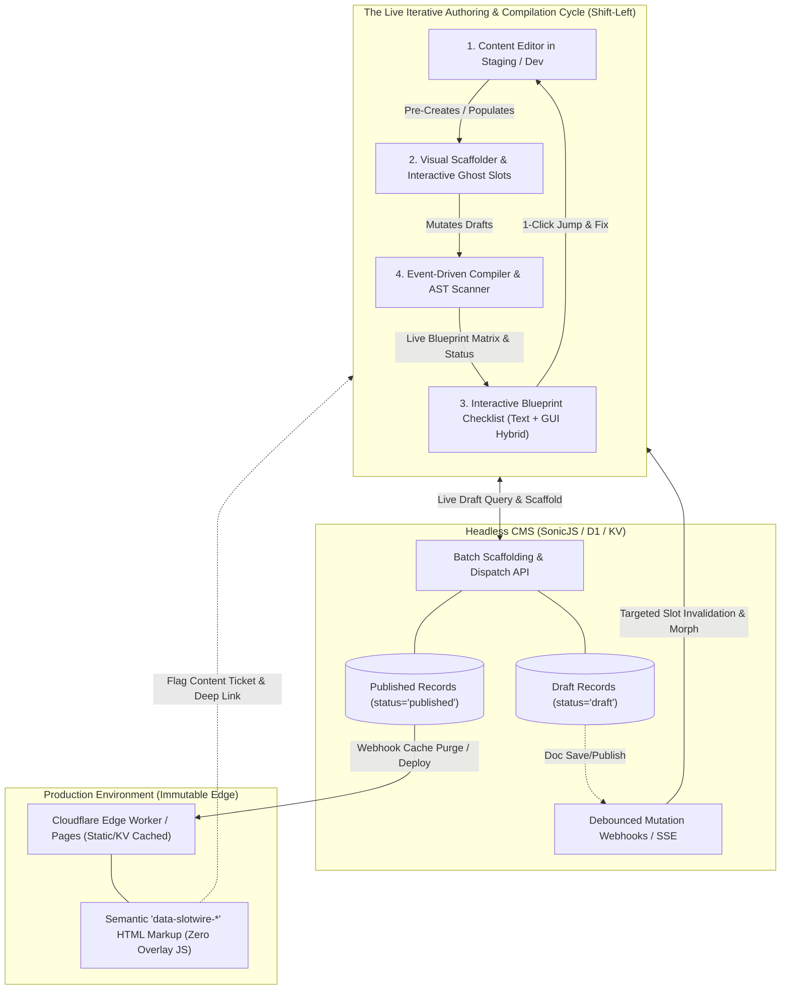
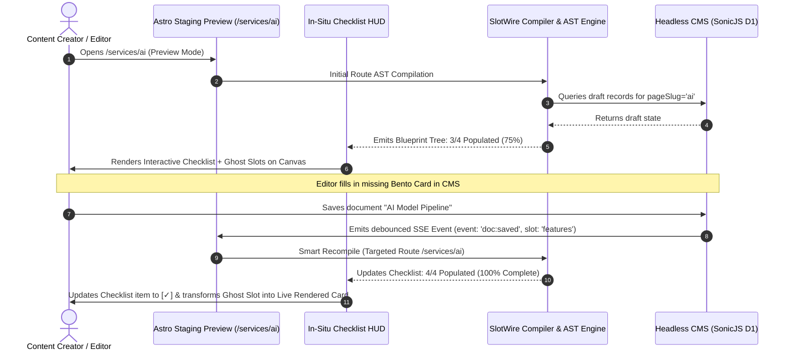
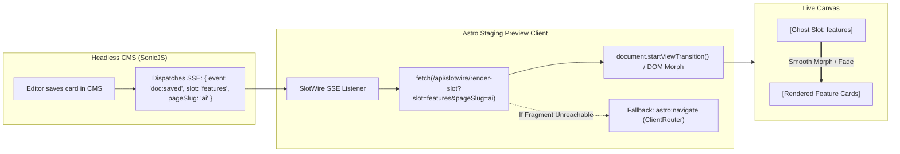
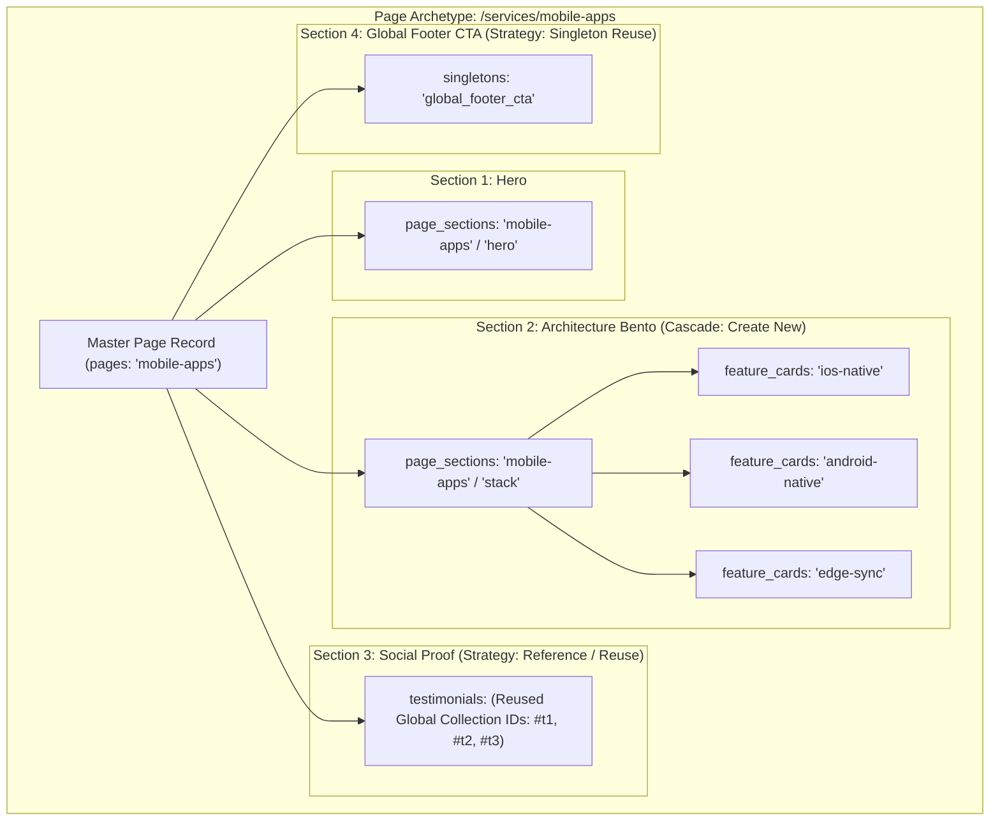
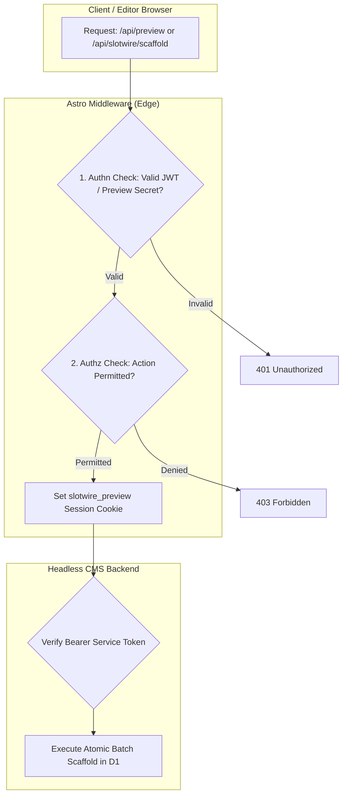

# SlotWire Visual Scaffold, Nested Archetype & Live Compilation Architecture

## 1. Executive Summary & Business Workflow

The primary value proposition of SlotWire is to eliminate the **"Headless Disconnect"** for content creators, editors, and frontend developers. Instead of forcing editors to work blindly across decoupled database forms in a backend CMS, SlotWire turns the frontend into an interactive, visual workshop while preserving the performance, security, and immutability of production edge deployments.



---

### The Editorial Lifecycle: Iterative Live Cycle Prior to Deploy

1. **Continuous Live Compilation & In-Situ Authoring (Staging / Dev)**:
   - **90% of editorial and structural action happens in this tight, iterative loop.**
   - Editors browse the live staging site with active preview credentials (`slotwire_preview=true`).
   - **Smart Event-Driven Compilation**: Rather than unconstrained background polling, the SlotWire AST Scanner & Contract Engine compiles the route on mount and re-compiles intelligently via **CMS debounced Server-Sent Events (SSE) / Webhooks** or a **manual `[ ↻ Recompile ]` button**.
   - **Per-Component Live Slot Morphing (Zero Page Reload)**: Saving content in the CMS triggers an in-place AST fragment fetch and View Transition that smoothly morphs the dashed Ghost Slot into live rendered markup without refreshing the page or losing scroll position.
   - **Text + GUI Hybrid Workbench**:
     - Visual canvas renders interactive ghost wireframes (*"UNPOPULATED SLOT: feature_cards — Click to Add Content"*).
     - Live **Interactive Blueprint Checklist HUD** provides a structured, confidence-inspiring checklist showing full archetype progress with 1-click canvas scrolling and direct deep links into the CMS editor.
   - **Archetype Pre-Creation**: Editors click *"Pre-Create Page Like This"* on an archetype template. SlotWire calculates the structural blueprint, automatically cascades nested draft records in the CMS, and re-compiles the route live.
2. **Review & Gate**:
   - Content editors complete copy and mark records as `ready_for_review` / `published` in the CMS.
   - Because compilation and verification occurred iteratively during authoring, pre-deployment checks in CI/CD are a zero-surprise formality rather than a late failure point.
3. **Production Verification & Ticket Loop**:
   - Production delivers pure, high-performance static HTML (TTFB ~15ms) without any overlay or scaffolding scripts.
   - Rendered DOM elements retain lightweight `data-slotwire-*` semantic attributes.
   - If an editor or QA finds a content gap on production, clicking a lightweight bookmarklet or diagnostic trigger captures the `data-slotwire-*` context and opens a **Fix Ticket** deep-linked directly to the corresponding staging draft in the CMS.

---

## 2. Division of Responsibilities & Subsystem Architecture

To maintain strict modularity and fail-fast contract integrity, responsibilities are cleanly divided across four subsystems:

```
┌────────────────────────────────────────────────────────────────────────────────────────┐
│                               Division of Responsibilities                             │
├──────────────────────────┬──────────────────────────┬──────────────────────────────────┤
│ Layer / Package          │ Runtime / Location       │ Core Responsibilities                   │
├──────────────────────────┼──────────────────────────┼──────────────────────────────────┤
│ 1. @slotwire/core        │ Universal (Node/Edge/JS) │ • Fluent schema contracts (Zod)  │
│                          │                          │ • 2-Pass reverse route resolver  │
│                          │                          │ • Nested archetype dependency tree│
│                          │                          │ • Blueprint generation logic     │
├──────────────────────────┼──────────────────────────┼──────────────────────────────────┤
│ 2. astro-slotwire        │ Astro Frontend (SSR/SSG) │ • <SlotWire /> component wrapper │
│    (@slotwire/astro)     │                          │ • Semantic data-slotwire-* DOM tags│
│                          │                          │ • In-situ Ghost Slot rendering   │
│                          │                          │ • Per-component SSR fragment API │
│                          │                          │ • Interactive Blueprint Checklist│
│                          │                          │ • /api/preview dispatch bridge   │
│                          │                          │ • In-situ Pre-Create modal       │
├──────────────────────────┼──────────────────────────┼──────────────────────────────────┤
│ 3. @slotwire/sonicjs     │ CMS Backend              │ • Schema reflection & discovery  │
│    (CMS Adapters)        │ (Cloudflare Worker / D1) │ • Atomic batch draft scaffolder  │
│                          │                          │ • Debounced SSE mutation stream  │
│                          │                          │ • CMS editor preview toolbar     │
│                          │                          │ • Webhook cache purge dispatcher │
├──────────────────────────┼──────────────────────────┼──────────────────────────────────┤
│ 4. @slotwire/cli         │ Dev / Preview / CI       │ • Live continuous compiler/runner│
│    (Compiler & Scanner)  │                          │ • AST / HTML slot auditor        │
│                          │                          │ • Slot completeness matrix       │
│                          │                          │ • Pre-deploy backstop validation │
└──────────────────────────┴──────────────────────────┴──────────────────────────────────┘
```

---

## 3. The Live Compilation & Verification Loop: Text + GUI Checklist & Smart Triggers

Pushing verification exclusively to a late build/CI phase creates developer and editor friction. SlotWire shifts verification **left into the active authoring cycle**, pairing visual canvas tools with an **Interactive Blueprint Checklist HUD** powered by smart, event-driven compilation.



---

### A. The Interactive Blueprint Checklist HUD (Text + GUI Hybrid)

In staging/preview mode, editors can toggle the **SlotWire Blueprint Checklist Drawer**. This provides a structured, hierarchical breakdown that pairs visual spatial cues with structured text feedback:

```
┌─────────────────────────────────────────────────────────────────────────────┐
│ ⚡ SlotWire Blueprint Checklist: /services/ai                      [ ↻ Rescan ]│
│ Overall Completeness: [██████████████░░░░░] 75% (3/4 Required Slots)       │
├─────────────────────────────────────────────────────────────────────────────┤
│ ▾ [✓] Master Page Container (pages: 'ai')                     [ Edit in CMS ]│
│   • Title: "Enterprise AI Solutions"                                        │
│   • Hero Badge: "Next-Gen Intelligence"                                     │
│                                                                             │
│ ▾ [✓] Section: Architecture Bento (page_sections: 'stack')    [ Edit in CMS ]│
│   ├─ [✓] Card 1: "Real-Time Inference" (colSpan: 2)                        │
│   ├─ [✓] Card 2: "Edge Vector Storage" (colSpan: 1)                         │
│   └─ [ ] Card 3: "UNPOPULATED SLOT: 'pipeline'"       [ 📍 Scroll ] [+ Add] │
│                                                                             │
│ ▾ [⚯] Section: Social Proof (testimonials)                    [ Shared Ref ]│
│   • Reusing 3 Global Partner Quotes (Filter: featured=true)                 │
│                                                                             │
│ ▾ [❌] Section: Bottom CTA Banner (singletons: 'footer_cta')   [ 📍 Scroll ] │
│   • Status: Empty Ghost Slot Active                   [ 🚀 Scaffold Draft ] │
├─────────────────────────────────────────────────────────────────────────────┤
│ Status: ⚠️ 1 Missing Required Slot • Pre-Deploy Quality Gate: BLOCKED        │
└─────────────────────────────────────────────────────────────────────────────┘
```

#### Key Checklist Capabilities:
1. **[ 📍 Scroll to Canvas ]**: Smooth-scrolls the viewport directly to the corresponding `<SlotWire />` or Ghost Slot on the live rendered page with a subtle highlight glow.
2. **[ Edit in CMS ] / [+ Add Card]**: Deep-links directly to the CMS edit form pre-populated with foreign keys (`pageSlug="ai"`, `sectionKey="stack"`).
3. **[ 🚀 Scaffold Draft ]**: Directly scaffolds missing child records without leaving the preview page.

---

### B. Smart Compilation Trigger Strategy (Compute & Resource Guardrails)

Continuous compilation must be computationally efficient without noisy, runaway background loops. SlotWire implements a 4-tiered triggering policy:

| Trigger Source | Mechanism | When it Fires | Resource Cost |
| :--- | :--- | :--- | :--- |
| **1. Route Mount / Navigation** | Local AST check + cached CMS read | Once on page load or client-side route transition. | Minimal (~5ms) |
| **2. CMS Event Stream (SSE)** | Server-Sent Events / Webhook | Debounced (500ms) when an editor clicks **Save** or **Publish** in CMS. | Low (Event-driven only) |
| **3. Manual Rescan Button** | In-situ `[ ↻ Rescan ]` button | On-demand when editor or developer clicks the toolbar action. | Explicit / Zero Idle Cost |
| **4. CLI Watch / Pre-Deploy** | `@slotwire/cli watch` & `scan` | File change in dev mode or static audit in CI/CD pipeline. | Fast batch process |

> [!IMPORTANT]
> **No Unbounded Polling**: SlotWire never runs client-side `setInterval()` polling loops against CMS APIs. Route status re-compiles exclusively on mount, user command, or debounced push events.

---

## 4. Per-Component Dynamic Re-Rendering & Live Slot Morphing

To deliver a fluid, high-confidence authoring experience, SlotWire supports **partial, per-component client-side re-rendering without requiring full page refreshes**.



### Dynamic Fragment Swapping Architecture

1. **Custom Element Container**: In preview mode, `<SlotWire slot="features" ... />` renders inside a lightweight custom element container `<slotwire-slot data-slotwire-slot="features">`.
2. **On-Demand SSR Fragment Endpoint (`/api/slotwire/render-slot`)**:
   - Accepts `?slot={slotKey}&pageSlug={pageSlug}`.
   - Evaluates the corresponding `.astro` component on the SSR isolate with the freshest draft data.
   - Returns pure HTML for that component.
3. **Smooth View Transition Morphing**:
   - The preview runtime replaces the inner HTML of the target `<slotwire-slot>` container.
   - Using the browser's native `document.startViewTransition()`, the dashed Ghost Slot smoothly morphs and animates into the live styled cards without layout jarring or white flashes.
4. **Resilient Fallback (Astro Client Router)**:
   - If a slot cannot be resolved as an isolated fragment, the runtime triggers Astro's native soft navigation:
     ```javascript
     window.astro?.navigate?.(window.location.href, { history: 'replace' });
     ```
   - This re-fetches the page in the background and morphs changed DOM nodes while preserving scroll position and open checklist drawers.

---

## 5. Nested Archetype Architecture: Cascade Scaffolding vs. Content Reuse

Real-world web layouts are hierarchical: a **Page** contains **Sections**, a **Section** contains **Card Grids** or **Galleries**, and grids contain **Individual Items**. Additionally, components frequently reference shared global content (e.g., global testimonial carousels, founder bios, shared CTA banners).



### Blueprint Resolution Engine

When scaffolding a nested archetype, `@slotwire/core` traverses the declared contract tree and distinguishes between two creation strategies:

1. **Cascade Scaffolding (`strategy: 'cascade'`)**:
   - Creates brand-new draft documents in child collections keyed to the target `pageSlug` and `sectionKey`.
   - Populates sensible semantic defaults (e.g., `"New Feature Title"`, `colSpan: 1`, `order: 10`).
2. **Content Reuse / Reference (`strategy: 'reference'`)**:
   - Identifies global collections or singletons that should **not** be duplicated.
   - Automatically references existing record IDs or binds to shared category keys (e.g., `category="mobile"`) without polluting the CMS with redundant duplicate records.

#### Blueprint Tree Definition (`slotwire.config.ts`)

```typescript
import { s, defineContract } from '@slotwire/core';

export default defineContract({
  cms: {
    provider: 'sonicjs',
    apiUrl: 'https://cms.example.com',
  },
  archetypes: {
    service_page: s.page({
      collection: 'pages',
      slots: {
        hero: s.section({ key: 'hero', strategy: 'cascade' }),
        features: s.section({
          key: 'features',
          strategy: 'cascade',
          children: s.collection('feature_cards', { minItems: 3, defaultCount: 4 }),
        }),
        testimonials: s.reference('testimonials', {
          strategy: 'reuse_shared',
          defaultFilter: { featured: true },
        }),
        cta: s.singleton('global_footer_cta', { strategy: 'reference' }),
      },
    }),
  },
});
```

---

## 6. Production Semantic Tagging (`data-slotwire-*`) & Issue Ticketing

Production builds remain 100% free of heavy client-side JavaScript, scaffolding modals, or visual overlays. However, `<SlotWire />` components preserve **lightweight semantic dataset attributes** in the static HTML markup.

### Semantic DOM Signature

```html
<!-- Clean Production Rendered HTML -->
<section 
  data-slotwire-slot="about_philosophy"
  data-slotwire-archetype="feature_cards"
  data-slotwire-collection="feature_cards"
  data-slotwire-page="about"
  data-slotwire-section="philosophy"
  class="relative py-24"
>
  <div 
    data-slotwire-id="doc-phil-1" 
    data-slotwire-slug="continuous-craft"
    class="bento-card"
  >
    <h3>Continuous Craft</h3>
    <p>Iterative design and high-fidelity prototypes...</p>
  </div>
</section>
```

### Production Content Ticket Dispatcher

When an editor or QA auditor views a production page and notices missing or outdated copy:
1. A lightweight browser bookmarklet or authenticated diagnostic trigger inspects the selected DOM node.
2. The script extracts the `data-slotwire-*` dataset (`collection`, `page`, `section`, `id`).
3. It immediately generates an actionable **Fix Content Ticket** or opens a direct deep link into the staging environment:
   ```
   https://staging.example.com/about?slotwire_preview=true#slotwire-highlight=about_philosophy
   ```
4. The staging environment activates the live Ghost Slot / CMS Edit link for that exact component.

---

## 7. Authentication & Authorization (Authn & Authz) Architecture



### A. Authentication (Authn): Leveraging Astro-Native Primitives

1. **Preview Token Verification (`/api/preview`)**:
   - The CMS dispatches editors to Astro with an HMAC-SHA256 signed token:
     `?secret=<SIGNATURE>&collection=pages&slug=technology&exp=1740873600`
   - Astro middleware verifies the signature using `env.SLOTWIRE_PREVIEW_SECRET`.
   - On success, sets an `HttpOnly`, `SameSite=Lax`, `Secure` session cookie (`slotwire_preview=<JWT>`) with a 4-hour expiration.
2. **Scaffold Dispatch Authentication (`/api/slotwire/scaffold`)**:
   - The in-situ scaffolding modal sends POST requests with the preview session cookie.
   - Astro edge middleware verifies the session before proxying requests to the CMS.
3. **CMS Service Communication**:
   - Astro communicates with the CMS backend using an isolated server-to-server API key (`env.SLOTWIRE_CMS_API_KEY`), never exposed to client browsers.

### B. Authorization (Authz): Open Baseline with Role Extension Hooks

- **Current Baseline (Open Authz)**:
  - Any user possessing a valid preview session cookie can preview drafts and scaffold new archetype drafts.
- **Designed Extensibility Hooks**:
  - Contracts support pluggable policy guards for enterprise environments:
    ```typescript
    export interface SlotWireAuthPolicy {
      canPreview(user: SlotWireUser, route: string): boolean;
      canScaffold(user: SlotWireUser, archetype: string): boolean;
      canPublish(user: SlotWireUser, collection: string): boolean;
    }
    ```
- **Security Boundaries & Guardrails**:
  - **Fail Fast & Rate Limiting**: Batch scaffolding endpoints limit requests (e.g., max 10 scaffold actions / minute per IP/user) to prevent accidental database flooding.
  - **CSRF Protection**: All mutation endpoints require a custom header (`x-slotwire-action: scaffold`).
  - **Environment Isolation**: Production workers reject all `/api/slotwire/scaffold` calls unless explicitly configured with preview credentials.

---

## 8. Phased Implementation Roadmap

```
┌────────────────────────────────────────────────────────────────────────────────────────┐
│                              Implementation Phases                                     │
├────────────────────────────────────────────────────────────────────────────────────────┤
│ Phase 1: Semantic DOM Tagging & Interactive Ghost Slots in Astro                       │
│ • Update <SlotWire /> Astro component to output semantic `data-slotwire-*` attributes. │
│ • Implement interactive <SlotWireGhost /> component for empty collections in preview.  │
│ • Build CMS deep-link resolver for 1-click navigation from ghost slot to CMS editor.   │
├────────────────────────────────────────────────────────────────────────────────────────┤
│ Phase 2: Live Compiler Loop, Interactive Checklist & Per-Component Slot Morphing       │
│ • Implement Interactive Blueprint Checklist HUD (Text + GUI Hybrid) in preview.       │
│ • Add smart compilation triggers: Route Mount + Debounced CMS SSE events + [ ↻ Rescan ]│
│ • Implement `/api/slotwire/render-slot` Astro SSR fragment endpoint for zero-reload.   │
│ • Implement `document.startViewTransition()` live morphing from Ghost Slot to markup.  │
│ • Implement nested archetype dependency tree resolver (cascade vs. reuse) in core.    │
│ • Implement `scaffoldBlueprint()` in `SlotWireCmsAdapter` (@slotwire/sonicjs).         │
│ • Build in-situ Pre-Create modal (`astro-slotwire/client.ts`) for 1-click cloning.     │
├────────────────────────────────────────────────────────────────────────────────────────┤
│ Phase 3: Automated CLI Scanner & CI Backstop Quality Gate                             │
│ • Implement `@slotwire/cli scan` & `slotwire watch` compiler commands.                 │
│ • Generate Content Gap Matrix reports and pre-deploy CI validation.                    │
├────────────────────────────────────────────────────────────────────────────────────────┤
│ Phase 4: Production Ticket Dispatcher & Auth Hardening                                 │
│ • Build lightweight production diagnostic trigger / bookmarklet for ticket creation.  │
│ • Implement HMAC token rotation, rate-limiting, and Astro middleware auth guards.      │
├────────────────────────────────────────────────────────────────────────────────────────┤
│ Future / Backburner: Dedicated Browser Extension / Chrome Side Panel                   │
│ • Evaluate Chrome Side Panel companion for advanced multi-tab CMS telemetry.           │
└────────────────────────────────────────────────────────────────────────────────────────┘
```
