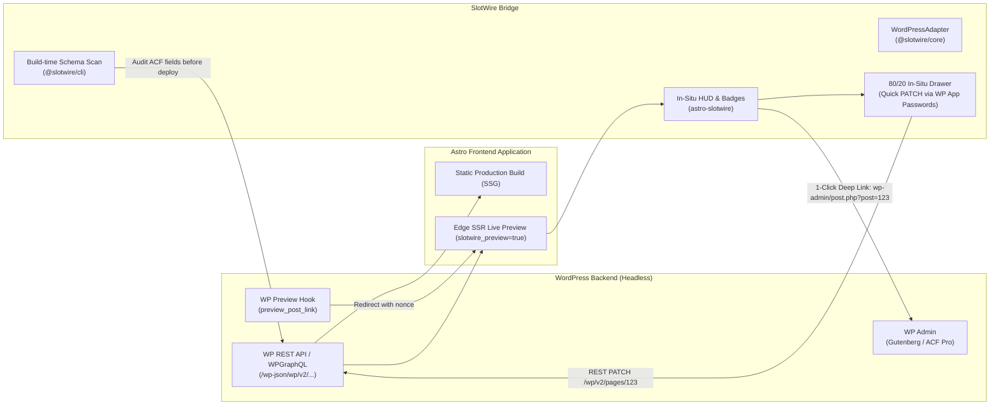

# SlotWire + Decoupled WordPress: Strategy, Value Proposition & Integration Architecture

> **The Executive Summary**: Yes, there is **massive value and purpose** for SlotWire in an "Astro + WordPress Decoupled" stack. 
> 
> WordPress powers over 40% of the web. Decoupling WordPress to Astro gives developers the speed, security, and perfect Core Web Vitals they crave, but it usually creates a **painful, broken editorial experience**: previews break, ACF fields are impossible to find, and empty fields crash static builds. 
> 
> **SlotWire solves the exact friction points that make agencies and clients abandon headless WordPress projects.**

---

## 1. The Core Tension: Why Teams Decouple WordPress (And Where It Breaks)

```
┌──────────────────────────────────────┬──────────────────────────────────────┐
│  WHY DEVELOPERS WANT ASTRO           │  WHY EDITORS WANT WORDPRESS          │
├──────────────────────────────────────┼──────────────────────────────────────┤
│ • 65–70%+ Core Web Vitals pass rates │ • Writers already know WP Admin      │
│ • Zero client-side JS by default     │ • Advanced Custom Fields (ACF Pro)   │
│ • Immunity from WP PHP/MySQL CVEs    │ • SEO plugins (Yoast, RankMath)      │
│ • Blazing-fast edge static delivery  │ • Client refusal to learn new tools  │
└──────────────────────────────────────┴──────────────────────────────────────┘
                                  │
                                  ▼
                   THE HEADLESS WORDPRESS DISCONNECT
     (Previews break, editors get lost, and layouts fail silently)
```

When an agency decouples WordPress, developers celebrate, but the content team suffers from four chronic problems:

### 🚨 1. The "Preview" Button is Completely Broken
In monolithic WordPress, clicking **"Preview Changes"** renders the draft in the PHP theme. In decoupled WordPress, clicking "Preview" either opens a 404 page, a blank screen, or an outdated static build from 4 hours ago. Editors are forced to publish blindly to production.

### 🚨 2. The ACF (Advanced Custom Fields) "Needle in a Haystack"
Modern headless WordPress sites rely on ACF Pro with 30–80 custom fields, nested repeaters, and flexible content layouts. When an editor spots a typo in "Card 3" on the Astro website, they have to:
1. Log into WordPress,
2. Search for the page,
3. Scroll through a monolithic vertical wall of ACF boxes,
4. Guess which repeater row corresponds to "Card 3",
5. Save, wait, and guess if it updated.

### 🚨 3. Schema Drift & Layout Collapse
If an editor leaves an ACF image field empty, deletes a repeater row, or adds an unmapped Gutenberg block, Astro’s static build often fails, or worse: the live page renders with collapsed CSS grid layouts or broken `undefined` images.

---

## 2. Where SlotWire Fits: The 4 Value Multipliers

SlotWire turns a fragile, disjointed headless WordPress setup into an integrated, enterprise-grade publishing system:



---

### Value Pillar 1: In-Situ 1-Click Deep Linking into WP Admin

WordPress administrative URLs are 100% standardized and deterministic:
* **Edit Page/Post**: `https://cms.domain.com/wp-admin/post.php?post={id}&action=edit`
* **Create New Post**: `https://cms.domain.com/wp-admin/post-new.php?post_type={type}`
* **Edit Category/Taxonomy**: `https://cms.domain.com/wp-admin/term.php?taxonomy={tax}&tag_ID={id}`
* **Edit Menus**: `https://cms.domain.com/wp-admin/nav-menus.php?menu={id}`

With SlotWire’s `WordPressAdapter`, every slot on the Astro staging site displays a hover badge. An editor viewing the live site can click **[📝 Edit in WordPress ↗]** and land **directly inside the exact post edit screen in WP Admin**. No searching, no filtering, no guessing.

---

### Value Pillar 2: The Native WordPress Preview Bridge

SlotWire restores the legendary WordPress "Preview" button without requiring complex third-party SaaS tools.

#### How It Works:
1. A 10-line WordPress mu-plugin hooks into WordPress’s native `preview_post_link`:
   ```php
   // wp-content/mu-plugins/slotwire-preview.php
   add_filter('preview_post_link', function ($link, $post) {
       $preview_domain = 'https://preview.yourastrosite.com';
       $slug = get_page_uri($post->ID);
       $token = wp_create_nonce('slotwire_preview_' . $post->ID);
       
       return "{$preview_domain}/{$slug}?slotwire_preview=true&post_id={$post->ID}&token={$token}";
   }, 10, 2);
   ```
2. When the editor clicks **"Preview"** in WordPress, WordPress redirects them directly to the **Astro Edge Staging URL**.
3. Astro runs dynamic SSR via Cloudflare Workers / Node, queries the draft revision from WP REST API (`/wp/v2/pages/{id}/revisions`), and renders the live draft instantly.
4. SlotWire injects its `<AssistBubble />` showing: **`[Status: Draft Modified]`**, along with Ghost slots and in-situ badges.

---

### Value Pillar 3: Build-Time ACF Contract Protection (`@slotwire/cli scan`)

In a decoupled site, an editor leaving an ACF field blank can break the production build. SlotWire acts as the **CI/CD safety barrier**:

```typescript
// slotwire.config.ts
import { defineContract, s } from '@slotwire/core';

export default defineContract({
  cms: {
    provider: 'wordpress',
    apiUrl: 'https://cms.yourdomain.com',
  },
  slots: {
    // Contract models ACF fields
    hero: s.object({
      headline: s.string().min(5),
      tagline: s.string().optional(),
      cover_image: s.url(),
      cta_button: s.object({
        label: s.string(),
        url: s.url(),
      }),
    }),
    services_matrix: s.collection('services', {
      name: s.string(),
      description: s.string().max(200),
      icon_slug: s.string(),
    }),
  },
});
```

* When running `npm run build`, `@slotwire/cli scan` checks all published WordPress posts against the contract.
* If an editor deleted a required image or left a CTA url blank, the build **fails gracefully with an exact, actionable warning**:
  ```bash
  ❌ [SlotWire Error] Page "/solutions/cloud" violates contract:
     Missing required ACF field: hero.cover_image
     Fix in WP Admin: https://cms.domain.com/wp-admin/post.php?post=412&action=edit
  ```

---

### Value Pillar 4: The 80/20 Quick Edit Drawer via WP Application Passwords

WordPress 5.6+ includes native support for **Application Passwords** out of the box (no external plugins required).

This enables SlotWire’s on-page Quick Drawer to perform sub-second updates without even loading the WordPress Admin:
1. The editor hovers over the Hero slot on the Astro preview and clicks **[⚡ Quick Edit]**.
2. A slide-over drawer opens on top of the live page with inputs for `headline` and `tagline`.
3. The editor edits the text and clicks **"Save"**.
4. The drawer issues an authenticated `POST` request directly to the WP REST API:
   ```http
   POST /wp-json/wp/v2/pages/412
   Authorization: Basic [base64_encoded_app_password]
   Content-Type: application/json

   {
     "title": "Updated Modern Headline",
     "acf": {
       "hero_tagline": "Blazing fast edge performance"
     }
   }
   ```
5. WordPress updates the record in 300ms. Astro’s preview revalidates immediately.
6. The editor fixed a typo **in 2 seconds without ever opening the heavy WP Admin dashboard.**

---

## 3. The `WordPressAdapter` Specification (`packages/core`)

Implementing WordPress support in `@slotwire/core` is clean and straightforward because WordPress URLs and REST endpoints are completely standardized:

```typescript
// packages/core/src/adapters/wordpress.ts
import type { CmsDeepLinkOptions } from '../types.js';
import { BaseCmsAdapter } from './base.js';

export class WordPressAdapter extends BaseCmsAdapter {
  readonly provider = 'wordpress';

  buildAdminLink(options: CmsDeepLinkOptions): string {
    const {
      adminUrl = 'https://cms.example.com/wp-admin',
      collection = 'pages',
      documentId,
      archetype,
    } = options;

    const base = this.cleanBaseUrl(adminUrl);
    // Ensure URL points to wp-admin root
    const wpAdminBase = base.endsWith('/wp-admin') ? base : `${base}/wp-admin`;

    // 1. Single Post / Page / Custom Post Type Edit
    if (documentId) {
      return `${wpAdminBase}/post.php?post=${encodeURIComponent(documentId)}&action=edit`;
    }

    // 2. New Record Creation
    if (options.action === 'create') {
      const postType = collection === 'pages' ? 'page' : collection === 'posts' ? 'post' : collection;
      return `${wpAdminBase}/post-new.php?post_type=${encodeURIComponent(postType)}`;
    }

    // 3. Navigation Menus
    if (collection === 'site_navigation' || archetype === 'navigation') {
      return `${wpAdminBase}/nav-menus.php`;
    }

    // 4. Collection List Views (Posts, Pages, or CPTs)
    if (collection === 'pages') {
      return `${wpAdminBase}/edit.php?post_type=page`;
    }
    if (collection === 'posts') {
      return `${wpAdminBase}/edit.php`;
    }

    return `${wpAdminBase}/edit.php?post_type=${encodeURIComponent(collection)}`;
  }
}
```

---

## 4. The Companion WordPress Plugin: `slotwire-wordpress`

While developers *can* manually drop PHP snippets into `functions.php` or `mu-plugins/`, **building an official, lightweight WordPress companion plugin (`slotwire-wordpress`) is a massive strategic differentiator**.

In the WordPress world, non-technical site owners and agencies do not want to touch server files or edit theme code. A dedicated plugin allows them to install `slotwire.zip` (or install via the WordPress Plugin Directory) and configure everything from a clean settings page in **under 60 seconds**.

```
┌─────────────────────────────────────────────────────────────────────────────┐
│                      WHAT THE WORDPRESS PLUGIN DOES                         │
├─────────────────────────────────────────────────────────────────────────────┤
│ 1. Rewrites "Preview Changes" in Gutenberg & Classic Editor to Astro SSR    │
│ 2. Generates Cryptographically Signed HMAC Nonces for Draft Security        │
│ 3. Fires Instant Cache-Purge Webhooks to Astro on `save_post` (0ms Edge)   │
│ 4. Exposes ACF Field Contract Reflection Endpoint (`/wp-json/slotwire/v1`)   │
│ 5. Adds "⚡ View on Live Astro Site" Shortcut to the WP Admin Top Bar       │
└─────────────────────────────────────────────────────────────────────────────┘
```

---

### Plugin Architecture & Code Blueprint (`slotwire.php`)

The plugin is ultra-lightweight (zero external dependencies, `< 250 lines of PHP`) relying entirely on native WordPress core hooks:

```php
<?php
/**
 * Plugin Name: SlotWire Headless Bridge for Astro
 * Plugin URI:  https://github.com/bmoelk/slotwire
 * Description: Seamlessly bridges WordPress with Astro: live preview redirects, HMAC draft tokens, and instant cache revalidation.
 * Version:     1.0.0
 * Author:      BrainEndeavor / SlotWire Team
 * License:     MIT
 */

if (!defined('ABSPATH')) exit;

class SlotWire_WordPress_Bridge {
    private static $instance = null;

    public static function get_instance() {
        if (null === self::$instance) self::$instance = new self();
        return self::$instance;
    }

    private function __construct() {
        // 1. Settings Menu in WP Admin
        add_action('admin_menu', [$this, 'register_settings_page']);
        add_action('admin_init', [$this, 'register_settings']);

        // 2. Hijack Preview Button (Gutenberg & Classic)
        add_filter('preview_post_link', [$this, 'filter_preview_link'], 10, 2);

        // 3. Instant Cache Invalidation Webhook on Save
        add_action('save_post', [$this, 'trigger_revalidation_webhook'], 10, 3);

        // 4. WP Admin Bar "View on Astro" Shortcut
        add_action('admin_bar_menu', [$this, 'add_admin_bar_node'], 80);

        // 5. REST API Contract Reflection Endpoint
        add_action('rest_api_init', [$this, 'register_contract_endpoints']);
    }

    /**
     * Rewrite WordPress Preview URLs to point to Astro Staging with an HMAC Token
     */
    public function filter_preview_link($link, $post) {
        $preview_base = get_option('slotwire_preview_url', '');
        if (empty($preview_base)) return $link;

        $slug = get_page_uri($post->ID);
        $secret = get_option('slotwire_secret_key', '');
        
        // Generate time-limited HMAC token (valid for 15 minutes)
        $expires = time() + 900;
        $signature = hash_hmac('sha256', "{$post->ID}:{$expires}", $secret);

        return trailingslashit($preview_base) . $slug . '?' . http_build_query([
            'slotwire_preview' => 'true',
            'post_id'          => $post->ID,
            'post_type'        => $post->post_type,
            'expires'          => $expires,
            'signature'        => $signature,
        ]);
    }

    /**
     * Send instant on-demand revalidation ping to Astro edge worker when post is updated
     */
    public function trigger_revalidation_webhook($post_id, $post, $update) {
        if (defined('DOING_AUTOSAVE') && DOING_AUTOSAVE) return;
        if (wp_is_post_revision($post_id)) return;
        if ($post->post_status !== 'publish') return;

        $webhook_url = get_option('slotwire_webhook_url', '');
        $secret = get_option('slotwire_secret_key', '');
        if (empty($webhook_url)) return;

        wp_remote_post($webhook_url, [
            'blocking' => false, // Non-blocking: doesn't slow down the editor's save action
            'headers'  => [
                'Content-Type'         => 'application/json',
                'X-SlotWire-Signature' => hash_hmac('sha256', (string)$post_id, $secret),
            ],
            'body'     => wp_json_encode([
                'post_id'   => $post_id,
                'slug'      => get_page_uri($post_id),
                'post_type' => $post->post_type,
                'action'    => 'revalidate',
            ]),
        ]);
    }

    /**
     * Add "⚡ View on Astro Preview" button to the WordPress Top Admin Bar
     */
    public function add_admin_bar_node($admin_bar) {
        if (!is_admin()) return;
        $screen = get_current_screen();
        if (!$screen || $screen->base !== 'post') return;

        global $post;
        if (!$post) return;

        $preview_base = get_option('slotwire_preview_url', '');
        if (empty($preview_base)) return;

        $slug = get_page_uri($post->ID);
        $url = trailingslashit($preview_base) . $slug . '?slotwire_preview=true';

        $admin_bar->add_node([
            'id'    => 'slotwire_preview_shortcut',
            'title' => '<span class="ab-icon dashicons dashicons-external" style="margin-top:2px;"></span>⚡ Astro Preview',
            'href'  => $url,
            'meta'  => ['target' => '_blank'],
        ]);
    }

    /**
     * REST Endpoint for Build Scanner: Exposes Registered ACF Groups & Types
     */
    public function register_contract_endpoints() {
        register_rest_route('slotwire/v1', '/contracts', [
            'methods'             => 'GET',
            'permission_callback' => function() {
                return current_user_can('edit_posts');
            },
            'callback'            => function() {
                $acf_groups = function_exists('acf_get_field_groups') ? acf_get_field_groups() : [];
                return rest_ensure_response([
                    'status'    => 'ok',
                    'acfGroups' => $acf_groups,
                    'postTypes' => get_post_types(['public' => true], 'names'),
                ]);
            },
        ]);
    }

    public function register_settings_page() {
        add_options_page(
            'SlotWire Settings',
            'SlotWire Bridge',
            'manage_options',
            'slotwire',
            [$this, 'render_settings_page']
        );
    }

    public function register_settings() {
        register_setting('slotwire_settings', 'slotwire_preview_url');
        register_setting('slotwire_settings', 'slotwire_production_url');
        register_setting('slotwire_settings', 'slotwire_webhook_url');
        register_setting('slotwire_settings', 'slotwire_secret_key');
    }

    public function render_settings_page() {
        ?>
        <div class="wrap">
            <h1>⚡ SlotWire Headless Bridge for Astro</h1>
            <p>Configure the connection between your WordPress backend and your decoupled Astro frontend.</p>
            <form method="post" action="options.php">
                <?php
                settings_fields('slotwire_settings');
                do_settings_sections('slotwire_settings');
                ?>
                <table class="form-table">
                    <tr>
                        <th scope="row">Astro Staging / Preview URL</th>
                        <td>
                            <input type="url" name="slotwire_preview_url" value="<?php echo esc_attr(get_option('slotwire_preview_url')); ?>" class="regular-text" placeholder="https://preview.yourdomain.com" required />
                            <p class="description">Where WordPress will redirect authors when clicking "Preview Changes".</p>
                        </td>
                    </tr>
                    <tr>
                        <th scope="row">Astro Production URL</th>
                        <td>
                            <input type="url" name="slotwire_production_url" value="<?php echo esc_attr(get_option('slotwire_production_url')); ?>" class="regular-text" placeholder="https://yourdomain.com" />
                            <p class="description">Your public live website address.</p>
                        </td>
                    </tr>
                    <tr>
                        <th scope="row">Edge Revalidation Webhook URL</th>
                        <td>
                            <input type="url" name="slotwire_webhook_url" value="<?php echo esc_attr(get_option('slotwire_webhook_url')); ?>" class="regular-text" placeholder="https://yourdomain.com/api/slotwire/revalidate" />
                            <p class="description">Astro API endpoint to trigger instant edge cache purging on save.</p>
                        </td>
                    </tr>
                    <tr>
                        <th scope="row">Shared Secret Key</th>
                        <td>
                            <input type="password" name="slotwire_secret_key" value="<?php echo esc_attr(get_option('slotwire_secret_key')); ?>" class="regular-text" required />
                            <p class="description">Used to sign HMAC preview nonces and webhook authentication headers.</p>
                        </td>
                    </tr>
                </table>
                <?php submit_button('Save SlotWire Configuration'); ?>
            </form>
        </div>
        <?php
    }
}

add_action('plugins_loaded', ['SlotWire_WordPress_Bridge', 'get_instance']);
```

---

## 5. How to Sell "Astro + WordPress + SlotWire" to Clients

For web agencies and technical consultants, this combination is the **ultimate win-win pitch**:

```
┌─────────────────────────────────────────────────────────────────────────────┐
│                          THE AGENCY SALES PITCH                             │
├─────────────────────────────────────────────────────────────────────────────┤
│ To the Client's Marketing Team:                                             │
│ "You don't have to learn a new CMS. You keep WordPress, your familiar      │
│  dashboard, your SEO plugins, and your ACF fields. Nothing changes in your  │
│  daily editorial routine."                                                  │
├─────────────────────────────────────────────────────────────────────────────┤
│ To the Client's CTO / Stakeholders:                                         │
│ "Your public website is 100% decoupled into Astro on Cloudflare's edge.     │
│  It cannot be hacked via WordPress PHP vulnerabilities. Your Core Web Vitals│
│  jump to 99/100, page loads drop to 200ms, and your hosting bill drops."    │
├─────────────────────────────────────────────────────────────────────────────┤
│ The SlotWire Guarantee:                                                     │
│ "Unlike other headless WordPress agencies where previews break and editors  │
│  get confused, we install SlotWire to give you instant live previews,       │
│  1-click jumps from the site into WP Admin, and contract safety checks."    │
└─────────────────────────────────────────────────────────────────────────────┘
```

---

## 6. Deployment Topology & The "Deployed Bits"

A common architectural question when planning this integration is: **What exact pieces need to be deployed, and do we need one Astro worker or two?**

```
┌─────────────────────────────────────────────────────────────────────────────┐
│                          THE 3 DEPLOYED PIECES                              │
├─────────────────────────────────────────────────────────────────────────────┤
│ 1. WORDPRESS SERVER:                                                        │
│    • Standard WordPress instance (PHP / MySQL)                              │
│    • `slotwire-wordpress` plugin installed (rewrites preview, fires webhooks)│
├─────────────────────────────────────────────────────────────────────────────┤
│ 2. SLOTWIRE RUNTIME (Zero Extra Workers Needed):                            │
│    • SlotWire is NOT a separate standalone server or proxy worker.           │
│    • It lives directly inside the Astro codebase via `astro-slotwire`.      │
├─────────────────────────────────────────────────────────────────────────────┤
│ 3. ASTRO SITE WORKER(S):                                                    │
│    • Staging / Preview Role: Dynamic SSR, draft revisions, SlotWire HUD.    │
│    • Production Role: 100% static SSG, edge cached, zero SlotWire JS.       │
└─────────────────────────────────────────────────────────────────────────────┘
```

---

### Clarification: Do We Need a Separate "SlotWire Worker"?

**No.** When using SlottD, SlottD itself is an edge worker because it acts as the micro-CMS. But when pairing Astro with Decoupled WordPress, **WordPress is already your CMS backend**.

You do **not** need to deploy a third intermediary "SlotWire Worker" server. SlotWire compiles directly into the Astro application as an integration (`astro-slotwire`) and provides an optional lightweight edge endpoint inside Astro (`/api/slotwire/revalidate`) to handle cache purges.

---

### Architectural Decision: One Astro Worker vs. Two?

You can implement the Astro frontend using either **Two Separate Deployments** or **One Single Unified Worker**. Both are fully supported, but they offer distinct trade-offs:

```
┌──────────────────────────────────────┬──────────────────────────────────────┐
│  OPTION A: TWO DEPLOYMENTS           │  OPTION B: ONE UNIFIED WORKER        │
│  (Staging Worker + Static Prod)      │  (Single Edge Worker with Routing)   │
├──────────────────────────────────────┼──────────────────────────────────────┤
│ 1. `preview.mysite.com` (SSR Worker) │ 1. `mysite.com` + `preview.mysite.com`│
│ 2. `mysite.com` (100% Static SSG)   │    both handled by the SAME worker.  │
│                                      │                                      │
│ ✅ Strict security isolation         │ ✅ Only one deployment pipeline      │
│ ✅ Zero compute cost for production  │ ✅ Single `wrangler.toml`            │
│ ✅ Zero risk of locking out public   │ ⚠️ Must handle preview auth checks   │
│    visitors via Cloudflare Access    │    cleanly inside worker middleware. │
└──────────────────────────────────────┴──────────────────────────────────────┘
```

---

### Option A: Two Separate Deployments (⭐ STRONGLY RECOMMENDED)

**This is the official recommended architecture for all production and agency deployments.** 

There is virtually zero marginal overhead in deploying an extra Cloudflare Worker or Pages project (Cloudflare allows multiple worker projects with shared quotas, and static Pages sites have no compute charges). Operationally, completely decoupling staging/edit from production is dramatically superior.

#### 1. Production Site (`mysite.com`): 100% Static SSG
* **Compiled output**: `output: 'static'`
* **Hosting**: Cloudflare Pages or Cloudflare Workers Static Assets.
* **Operational Characteristics**:
  * 100% pre-rendered HTML files stored on Cloudflare's global edge network.
  * Costs **$0/month** on static hosting.
  * Zero server compute, 0ms cold starts, completely immune to WordPress downtime or database crashes.
  * SlotWire strips all telemetry scripts at build time; ships **0 KB client JavaScript**.

#### 2. Staging / Preview Site (`preview.mysite.com`): Dedicated SSR Worker
* **Compiled output**: `output: 'server'`
* **Hosting**: Cloudflare Worker isolate running Astro SSR.
* **Security & Access**:
  * Put cleanly behind **Cloudflare Access (Zero Trust)** so only authorized company emails can access the preview environment.
  * Authenticates with WordPress REST API to fetch live draft revisions and renders with SlotWire Assist Mode active.

#### Why Option A is Operationally Superior:
1. **Zero Blast Radius**: A runtime exception, unhandled ACF null field, or memory leak in the dynamic preview worker can **never take down the public production website**.
2. **Zero-Trust Simplicity**: Placing Cloudflare Access over the entire `preview.mysite.com` domain is foolproof. There is zero risk of complex middleware accidentally locking out public visitors on `mysite.com`.
3. **No Draft Leakage Risk**: In a single unified worker, a subtle bug in middleware header/cookie parsing could accidentally expose embargoed draft content to search engine crawlers. Option A physically separates environments.
4. **Independent Lifecycle**: Production deploys only when content is published or code releases are tagged. Staging continuously queries live WordPress draft APIs on demand.

---

### Option B: A Single Unified Worker (Lean & Budget Friendly)

If a team wants to manage only **one Cloudflare Worker deployment** and one Git repository, a single Astro worker can easily serve both roles using dynamic middleware:

```typescript
// src/middleware.ts
import { defineMiddleware } from 'astro:middleware';

export const onRequest = defineMiddleware(async (context, next) => {
  const url = new URL(context.request.url);
  const isPreviewHost = url.hostname.startsWith('preview.');
  const hasPreviewParam = url.searchParams.get('slotwire_preview') === 'true';

  // 1. Preview Request Handling
  if (isPreviewHost || hasPreviewParam) {
    // Validate HMAC signature from WordPress plugin
    const token = url.searchParams.get('token');
    const postId = url.searchParams.get('post_id');
    const isValid = verifyWordPressToken(postId, token);

    if (!isValid && !context.locals.isAuthenticated) {
      return new Response('Unauthorized SlotWire Preview Session', { status: 401 });
    }

    context.locals.isPreview = true;
    return next();
  }

  // 2. Standard Public Visitor Handling
  context.locals.isPreview = false;
  return next();
});
```

#### How It Works:
* Public requests to `mysite.com` are served directly from the edge cache with zero SlotWire overhead.
* When an author clicks "Preview" in WordPress, they are routed with the `?slotwire_preview=true` token. The single worker bypasses the cache, queries draft revisions from WordPress, and injects SlotWire's in-situ authoring UI.

---

## 7. Technical Verdict: Is It Worth Supporting?

| Factor | Assessment |
| :--- | :--- |
| **Market Size** | **Massive (~40%+ of all websites)**. Far larger than Strapi, Sanity, and Storyblok combined. |
| **Pain Point Severity** | **Critical**. Previews and ACF field hunting are the #1 reasons decoupled WP projects fail. |
| **Implementation Complexity for SlotWire** | **Very Low**. WordPress admin URLs are completely standardized. The `WordPressAdapter` requires `< 60 lines of code`. |
| **Astro Synergy** | **Natural**. Astro already has extensive official guides and Content Layer loaders for WordPress REST and WPGraphQL. |

### Strategic Recommendation:
**Yes, build the `WordPressAdapter`**. It requires minimal engineering effort, but immediately unlocks the largest existing CMS user base in the world and gives SlotWire an instant, high-demand commercial agency use case.
